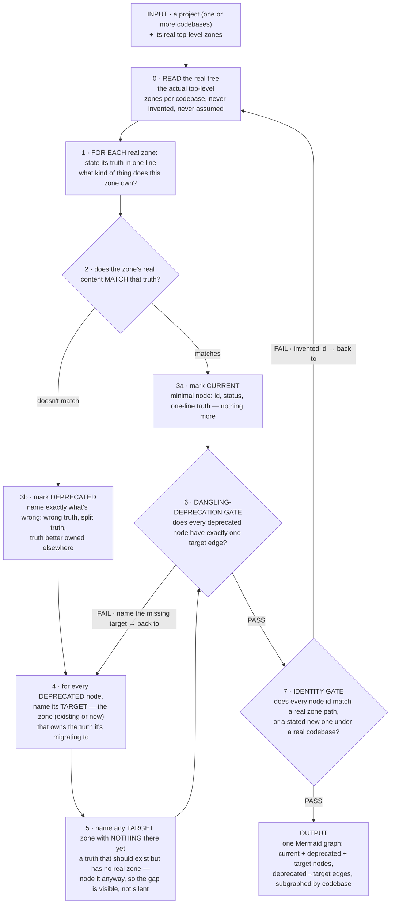

# The Architecture Map

The map exists so "is this in the right place, and is it moving toward or away from where
it should be" is answerable by structure — a graph a query can traverse — never a claim
anyone has to be trusted to remember or assert correctly. A diagram that looks right but
can't be checked has already failed at the one thing this skill produces.

This is not a description of the codebase. What a zone's real content is can always be
read off the real file tree — this skill never re-authors that. What the tree *cannot*
say is intent: where a zone is supposed to end up, and where a deprecated zone is
migrating to. That is the only thing this skill exists to author.

## The non-negotiables

1. **One graph, not three pictures.** Current, deprecated, and target status live as
   annotations on the *same* nodes and edges — never as three separate diagrams. The
   reason the three views exist at all is the arrows between them; three disconnected
   pictures have no arrows, and no computable distance.
2. **Current is derived, never re-authored.** Before marking anything, consult the
   actual repository tree for the real zones. A zone whose real content already matches
   its purpose gets a minimal `current` node — confirming it's accounted for, not
   describing it again.
3. **No dangling deprecation.** Every `deprecated` node carries exactly one edge to the
   `target` node it migrates to. "This is going away" with no stated destination is not
   a valid node — it's an unfinished thought.
4. **Node identity must be real.** A node's id is the exact zone path as it exists in
   the repository (a real top-level directory, namespaced by codebase when a project
   spans more than one). An invented label that can't be joined back to the real tree
   is not a node in this graph — it's decoration.
5. **One kind of truth per zone.** Every zone is nameable, in one line, as the kind of
   truth it owns. A construct's home follows from what kind of truth it is, never from
   which feature wanted it or where the edit was convenient. A zone that needs two
   unrelated one-line truths is two zones wearing one name.
6. **Names are meaning.** A zone or file is named for the concept it owns. `util`,
   `helper`, `common`, `misc` are not zone names — they're the symptom that the truth
   inside hasn't been identified yet.

## Building or updating the map



Both gates must hold before the map is done. A map presented without having named a
target for every deprecated node, or without every id tracing to a real zone, is not a
finished map — it's a picture that hasn't been checked.

## The schema

A node's label carries its status and truth as fixed, parseable lines — not free prose —
so a future deterministic reader can extract them the same way every time:

```
zone_id["<zone path><br/>status: current|deprecated|target<br/>truth: <one line>"]
```

Deprecated → target is an edge, not a comment:

```
old_zone -->|migrates to| new_zone
```

Multiple codebases group under one subgraph per codebase, so a node's full identity is
`codebase/zone`:

```
subgraph codebase_name["codebase_name (codebase)"]
    ...zone nodes...
end
```

`classDef`/`class` assigns a color per status (current / deprecated / target) — this is
the only place appearance is allowed to matter, and it's what makes the map readable as a
map, not just parseable as data.

A starting template with a worked example (one current zone, one deprecated zone with its
target, one not-yet-populated target zone) lives at `template.mmd` in this skill's
directory — copy it, replace the example zones with the real project's.

## The output contract

Building or updating the map, the chat output MUST contain these, in this order. Each
consumes the one before it — don't narrate around the sequence.

```xml
<zones>       every real zone found by reading the tree, with its stated one-line truth.
<matches>     per zone: MATCH (→ current) or MISMATCH naming what's wrong (→ deprecated).
<targets>     per deprecated zone, its target; plus any wholly new target zone named for
              a truth with no real zone yet. A deprecated zone with no target here is
              the gate-6 failure — go back and name one.
<gates>       gate 6 (dangling-deprecation) and gate 7 (identity) verdicts, PASS or FAIL
              naming the offending node.
<map>         the finished Mermaid graph — every zone from <zones>, every edge from
              <targets>, both gates PASS.
```

**The refusal test:** an absent or empty tag means that step did not run — stop and run
it. A map presented without `<zones>`/`<matches>`/`<targets>`/`<gates>` is a claim of
having read the real tree and checked every deprecation, without having done either.
