# Construction Planning

The domain is every atom of every open item — the stories you were handed are only a
SEED that starts the search, never the bound of it. The pass re-partitions a working
set that GROWS until it is honest: three nested fixpoints, not a line. Architecture
design is the constraint oracle — consulted for value boundaries and buildability
limits, never authored here.

```mermaid
flowchart TD
    IN["INPUT · SEED stories<br/>good content cut on the WRONG seams<br/>the seed only STARTS the search — it is NOT the domain"]

    ARCH[["ARCHITECTURE DESIGN · constraint oracle<br/>what nature permits · where the value boundaries fall<br/>— CONSULTED for constraints, never authored here"]]

    W["0 · SCOPE · working set W ← seed<br/>the domain is EVERY atom of EVERY open story;<br/>W is the sub-board this pass will re-partition"]

    A1["1 · ATOMIZE W to CLOSURE<br/>shred every story in W to irreducible atoms<br/>(one requirement / decision / deliverable)<br/>CONTENT IS CONSERVED — a bijection to the source text, nothing created or lost<br/>fixpoint: re-atomizing splits nothing further"]

    A2["2 · TYPE by REASON-TO-CHANGE<br/>Parnas 1972 / Single-Responsibility<br/>group by what changes together, for the same reason & stakeholder<br/>= the VALUE BOUNDARY · NEVER by execution step"]

    A3["3 · COUPLING GRAPH<br/>weighted edges over ALL atoms — dependency + cohesion<br/>edges MAY point to atoms in stories OUTSIDE W<br/>(those cross-border edges are what the closure gate reads)"]

    A4["4 · CLUSTER for COHESION<br/>modularity-maximization / Louvain community detection<br/>HIGH cohesion, LOW coupling · seams fall at the MIN-CUT"]

    G5{"5 · MECE GATE<br/>every atom in EXACTLY ONE cluster · ALL atoms placed<br/>= a valid SET-PARTITION of α(W) · no orphan, no double-home"}

    G6{"6 · INVEST + VERTICAL-SLICE GATE<br/>Independent·Negotiable·Valuable·Estimable·Small·Testable?<br/>each cluster cuts END-TO-END through value, never along a layer"}

    GB{"7 · BOUNDARY / CLOSURE GATE<br/>does ANY coupling edge ≥ θ cross the border of W?<br/>an outside atom pulled in, or an inside atom pulling one out<br/>= is W a UNION OF WHOLE COMMUNITIES yet?"}

    A7["8 · TOPOLOGICAL SORT → CRITICAL PATH<br/>order is DERIVED from the dependency graph, never chosen"]

    OUT["OUTPUT<br/>epics = clusters by VALUE BOUNDARY<br/>stories = INVEST vertical slices<br/>build order = CRITICAL PATH<br/>— over a set that is CLOSED, MECE, and INVEST-clean"]

    IN --> W --> A1
    ARCH -. "hands down value boundaries" .-> A2
    ARCH -. "hands down buildability limits" .-> A4
    A1 --> A2 --> A3 --> A4 --> G5
    G5 -- "FAIL · orphan or double-home → RE-CLUSTER" --> A4
    G5 -- "PASS · clean partition of α(W)" --> G6
    G6 -- "FAIL · too big / coupled / not vertical → SPLIT & re-cluster" --> A4
    G6 -- "PASS · every slice ships value" --> GB
    GB -- "OPEN · admit the pulled-in stories · W ← W ∪ ∂W → RE-ATOMIZE" --> A1
    GB -- "CLOSED · the border is a true MIN-CUT" --> A7
    A7 -- "CYCLE ⇒ a missing atom is CONFESSED ⇒ re-atomize" --> A1
    A7 --> OUT
```



The three fixpoints, all at rest before the pass is done — **enumeration** (re-atomizing
splits nothing further), **partition** (MECE and INVEST both hold on α(W)), **scope**:

    W* = μW. ( seed ⊆ W  ∧  every edge ≥ θ stays inside W )

Coupling-closure computes the same answer as re-clustering the entire board, over the
smallest set that yields it. Anything short of all three fixpoints is the classic
failure: one pass over a fixed seed, boundary never tested — renamed stories on their
original seams, not a re-slice.

## The output contract

The pass's chat output MUST contain these tags, in this order. Each tag consumes the
one before it, so the sequence is the derived construction order — never narrate around
it. Gate failures and scope growth repeat tags; the loops must stay visible.

```xml
<scope>            W as a story list; the seed named; one line naming the whole-board domain.
<round n="1">      one per scope iteration; a new round ONLY via an OPEN boundary verdict.
  <atoms>          the FULL numbered atom list — id, text, source story. Closure statement:
                   every source clause is exactly one atom or a named drop with its reason.
                   Reasoning over whole stories instead of atoms silently re-assumes the old
                   seams; without this list the pass is a 1:1 rename dressed as a re-slice.
  <types>          per atom: its reason-to-change type (what changes together, for the same
                   reason and stakeholder — never an execution step).
  <edges>          the weighted coupling edges; every edge crossing the border of W marked.
  <clusters>       each cluster as its atom-id set. Re-emitted after every gate FAIL.
  <mece_verdict>   PASS, or FAIL naming the orphaned/double-homed atom → new <clusters>.
  <invest_verdict> PASS, or FAIL naming the offending cluster and letter → new <clusters>.
  <boundary_verdict> CLOSED, or OPEN naming the admitted stories and W ← W ∪ ∂W → next <round>.
</round>
<topo_order>       the derived build order; a cycle names the missing atom → new <round>.
<output>           epics (value boundaries), stories (INVEST slices), critical path.
```

The refusal test: an absent or empty tag means that node did not run — stop and run it.
A result presented without its tags is a lie about having run the flow.
