```mermaid
flowchart TD
    IN["INPUT · SEED stories<br/>good content cut on the WRONG seams<br/>the seed only STARTS the search — it is NOT the domain"]

    ARCH[["ARCHITECTURE DESIGN · constraint oracle<br/>what nature permits · where the value boundaries fall<br/>— CONSULTED for constraints, never authored here"]]

    W["0 · SCOPE · working set W ← seed<br/>the domain is EVERY atom of EVERY open story;<br/>W is the sub-board this pass will re-partition"]

    A1["1 · ATOMIZE W to CLOSURE<br/>shred every story in W to irreducible atoms<br/>(one requirement / decision / deliverable)<br/>CONTENT IS CONSERVED — a bijection to the source text, nothing created or lost<br/>fixpoint: re-atomizing splits nothing further"]

    A2["2 · TYPE by REASON-TO-CHANGE<br/>Parnas 1972 / Single-Responsibility<br/>group by what changes together, for the same reason & stakeholder<br/>= the VALUE BOUNDARY · NEVER by execution step"]

    A3["3 · COUPLING GRAPH<br/>weighted edges over ALL atoms — dependency + cohesion<br/>edges MAY point to atoms in stories OUTSIDE W<br/>(those cross-border edges are what the closure gate reads)"]

    A4["4 · CLUSTER for COHESION<br/>modularity-maximization / Louvain community detection<br/>HIGH cohesion, LOW coupling · seams fall at the MIN-CUT"]

    G5{"5 · MECE GATE<br/>every atom in EXACTLY ONE cluster · ALL atoms placed<br/>= a valid SET-PARTITION of α(W) · no orphan, no double-home"}

    G6{"6 · INVEST + VERTICAL-SLICE GATE<br/>Independent·Negotiable·Valuable·Estimable·Small·Testable?<br/>each cluster cuts END-TO-END through value, never along a layer"}

    GB{"7 · BOUNDARY / CLOSURE GATE<br/>does ANY coupling edge ≥ θ cross the border of W?<br/>an outside atom pulled in, or an inside atom pulling one out<br/>= is W a UNION OF WHOLE COMMUNITIES yet?"}

    A7["8 · TOPOLOGICAL SORT → CRITICAL PATH<br/>order is DERIVED from the dependency graph, never chosen"]

    OUT["OUTPUT<br/>epics = clusters by VALUE BOUNDARY<br/>stories = INVEST vertical slices<br/>build order = CRITICAL PATH<br/>— over a set that is CLOSED, MECE, and INVEST-clean"]

    IN --> W --> A1
    ARCH -. "hands down value boundaries" .-> A2
    ARCH -. "hands down buildability limits" .-> A4
    A1 --> A2 --> A3 --> A4 --> G5
    G5 -- "FAIL · orphan or double-home → RE-CLUSTER" --> A4
    G5 -- "PASS · clean partition of α(W)" --> G6
    G6 -- "FAIL · too big / coupled / not vertical → SPLIT & re-cluster" --> A4
    G6 -- "PASS · every slice ships value" --> GB
    GB -- "OPEN · admit the pulled-in stories · W ← W ∪ ∂W → RE-ATOMIZE" --> A1
    GB -- "CLOSED · the border is a true MIN-CUT" --> A7
    A7 -- "CYCLE ⇒ a missing atom is CONFESSED ⇒ re-atomize" --> A1
    A7 --> OUT
```

# Construction Planning

The domain is every atom of every open item — the stories you were handed are only a
SEED that starts the search, never the bound of it. The pass re-partitions a working
set that GROWS until it is honest, and it is three nested fixpoints, not a line.

## The nodes

0. **Scope.** The domain is not the stories you were handed — it is every atom of every open item. The seed only *starts* the search; the working set W is the sub-board this pass will actually re-partition, and it grows until it is honest (node 7). Naming the domain as the whole board with the seed as a probe is the ontology-first correction: enumerate what exists, never assume the input bounds it.
1. **Atomize W to closure.** Shred every story in W into its irreducible content units — one requirement / decision / deliverable each — and throw away the current grouping. Enumerate to closure: content is conserved as a bijection to the source text — every clause lands as exactly one atom or is dropped with a stated reason, and re-atomizing an atom splits nothing further. (This is the node most easily skipped: reasoning over whole stories instead of atoms silently re-assumes the old seams and produces a 1:1 rename dressed as a re-slice.)
2. **Type each atom by its reason-to-change.** Parnas's 1972 criterion ("On the Criteria To Be Used in Decomposing Systems into Modules"), whose modern name is the Single Responsibility Principle: partition by what changes together / for the same reason / the same stakeholder, never by execution step. This is the map's definition of an epic ("the value boundary crossed") and "one true type per thing."
3. **Build the coupling graph** over atoms: weighted edges for dependency (consumer → dependency) and cohesion (changes-together). Edges may point to atoms in stories *outside* W — those cross-border edges are exactly what the closure gate (7) reads.
4. **Cluster for cohesion.** Group atoms so each cluster is maximally internally coupled and minimally coupled to others. Formally this is graph community detection / modularity maximization — NP-hard, standard heuristic Louvain (shipped as a fixed rule in the engine). The seam falls at the min-cut.
5. **Enforce MECE** (Minto — Mutually Exclusive, Collectively Exhaustive): every atom in exactly one cluster, all atoms placed. This is the correctness invariant — no loss, no double-ownership — the assertion that the new grouping is a valid set partition of α(W). Fail ⇒ re-cluster (4).
6. **Gate each cluster on INVEST** (Bill Wake) — Independent, Negotiable, Valuable, Estimable, Small, Testable — plus the vertical-slice rule: a story cuts end-to-end through value, never along a layer. Fail ⇒ split & re-cluster (4).
7. **Boundary / closure gate.** Ask whether any coupling edge at or above the seam threshold θ crosses the border of W — an outside atom pulled toward a cluster, or an inside atom pulling an outside one. If so, W was not a union of whole communities: admit the pulled-in stories (W ← W ∪ ∂W) and re-atomize (1). This is the ripple made terminating — re-cutting a cluster can pull in a neighbor, which can force a further re-cut — and it halts only when a full pass crosses no border. Closure means the border of W is itself a true min-cut, so re-partitioning W is *identical* to re-partitioning the whole board for those communities: lossless, while touching the minimal set.
8. **Derive sequence by topological sort** of the dependency graph — the critical path. Order is derived, not chosen; a cycle confesses a missing atom, so return to atomize (1).

Architecture design is the **constraint oracle**, not a step: consult it for the value boundaries (feeds 2) and the buildability limits (feeds 4) — never author the design here.

## Three fixpoints, nested

The flow is three loops, and a pass is done only when all three are at rest at once:

- **Enumeration** (node 1): atomize until nothing splits further — content conserved.
- **Partition** (nodes 4–6): cluster ⇄ gates until MECE *and* INVEST both hold on α(W).
- **Scope** (node 7): grow W until it is coupling-closed —
  `W* = μW. ( seed ⊆ W  ∧  every edge ≥ θ stays inside W )`.

The trivial upper bound is "re-cluster the entire board every time"; coupling-closure computes that same answer over the smallest set that yields it. Anything short of all three fixpoints is the classic failure: a single pass over a fixed seed with the boundary never tested — which returns renamed stories on their original seams, not a re-slice.

## Show your work

Run the pipeline node by node, in the open, printing each node's actual output before moving to the next — never jump to the story-level result. The visible artifacts are the proof the flow ran, and their absence is the tell that it did not:

- **Node 1** — the full numbered atom list, each atom tagged with its source story; state the closure check (every clause is one atom or a stated drop).
- **Node 2** — each atom's reason-to-change type.
- **Node 3** — the coupling edges, marking which cross the border of W.
- **Node 4** — each cluster as its atom set.
- **Nodes 5–6** — the gate verdicts, PASS or FAIL with the offending atom named; show the re-cluster when a gate fails.
- **Node 7** — the boundary verdict per round: OPEN (name the admitted stories, show `W ← W ∪ ∂W`) or CLOSED; print every round until closure.
- **Node 8** — the topological order, and any cycle that sent you back to node 1.

The refusal test: if you cannot show the atom list, you did not atomize — stop and do node 1 before claiming any result. A named result without its nodes is a lie about having run the flow.
