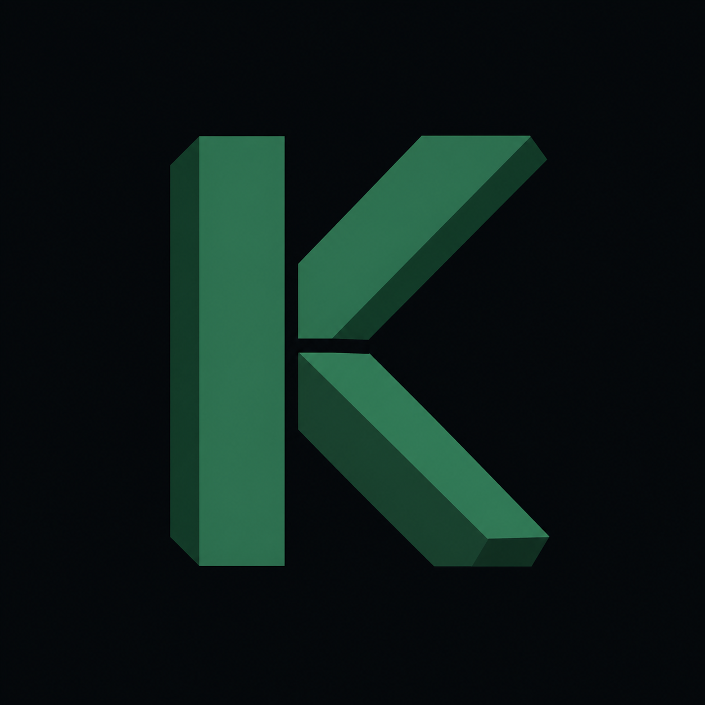
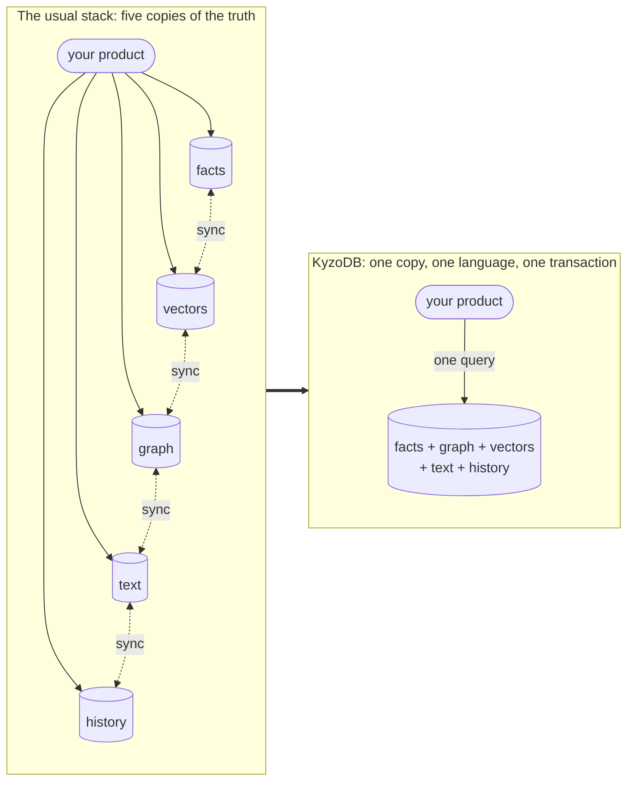
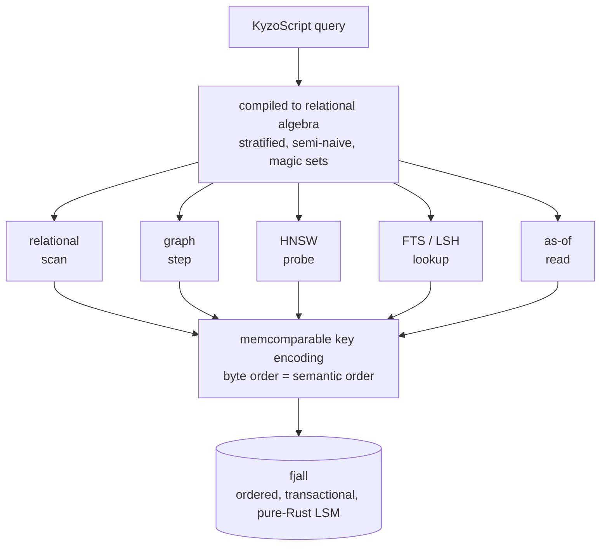
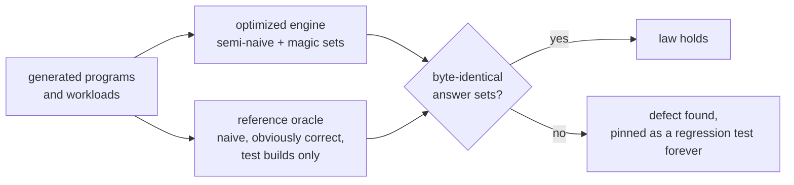

[](LICENSE.txt)

# KyzoDB

🚧 **UNDER CONSTRUCTION: this README describes the target state of an in-flight rebuild. The
[board](https://github.com/orgs/kyzodb/projects/1) is the live status; [Status](#status) below says
what is proven today.** 🚧

If you are building a knowledge-heavy product today, you usually end up spreading one domain across
five systems: Postgres for facts, a vector database for similarity, a graph store for relationships, a
search engine for text, and some history layer bolted on. Now you have a second product to build, one
no user asked for: keeping five copies of the truth synchronized, and explaining yourself when they
disagree.

KyzoDB collapses that into one embeddable, transactional database. Facts, relationships, semantic
similarity, text, near-duplicates, and historical state answer together, in one language, in one
transaction. A vector search is a join. A graph traversal is recursion. A read at a past instant is a
query parameter.

The point is not vector search inside a database. Vector search is becoming table stakes. The point is
that retrieval becomes composable and auditable: a semantic hit can join to structured facts, walk a
graph, respect time, and explain why the answer exists. The same query over the same facts returns the
same answer, and fails with the same refusal, every time.

> LLMs gave software the ability to think out loud. KyzoDB exists so that what such systems come to
> know can be held: exactly, durably, explainably, and identically every time it's asked for. Not the
> mind; the ground the mind stands on.

The technical reason this works is that every access path reduces to ordered reads over one
transactional storage substrate. The product reason it matters is retrieval you can trust, reproduce,
and inspect, from one database instead of five.



## Retrieval is one act

The retrieval paths a knowledge system usually spreads across five services are ordinary relations
here, so they combine in a single query.

Take documents that carry a title and a vector embedding, plus a relation recording which document
cites which:

```
?[id, title, emb] <- [
    ['graph-db',   'Graph databases',       [0.1,  0.9]],
    ['vec-search', 'Vector search',         [0.9,  0.1]],
    ['datalog',    'Datalog and recursion', [0.15, 0.85]],
    ['mvcc',       'Transactions and MVCC', [0.85, 0.2]]
]
:create doc {id: String => title: String, emb: <F32; 2>}

?[from, to] <- [['datalog', 'graph-db'], ['graph-db', 'mvcc'], ['vec-search', 'datalog']]
:create cites {from: String, to: String}
```

Index the embeddings with HNSW:

```
::hnsw create doc:emb {dim: 2, dtype: F32, fields: [emb], distance: L2, m: 50, ef_construction: 20}
```

A nearest-neighbour search binds with `~` and unifies like any other relation. Joined straight to
`cites`, one query performs semantic recall and then follows the relationships of whatever it finds:

```
?[hit, title, cited] := ~doc:emb{id: hit, title | query: q, k: 2, ef: 20},
                        *cites{from: hit, to: cited},
                        q = vec([0.12, 0.88])
```

| hit      | title                  | cited    |
|----------|------------------------|----------|
| datalog  | Datalog and recursion  | graph-db |
| graph-db | Graph databases        | mvcc     |

Full-text and near-duplicate search take the same shape. A full-text index over the same titles:

```
::fts create doc:text {extractor: title, tokenizer: Simple, filters: [Lowercase, Stemmer('English'), Stopwords('en')]}
```

answers `~doc:text{id, title | query: 'graph', k: 5}`. A MinHash-LSH index for
near-duplicates:

```
::lsh create doc:lsh {extractor: title, tokenizer: NGram, n_gram: 3, target_threshold: 0.5}
```

answers `~doc:lsh{id | query: 'Graph databases', k: 5}`. In every case the search result is a relation
you can join, filter, negate, and recurse over. Hybrid retrieval is a query, not a pipeline: there is
no fan-out layer, no re-ranking glue service, and no copy of your data waiting to drift.

## Recursion is native

The query language is Datalog, in a dialect called **KyzoScript**. Datalog expresses everything
relational algebra can, and it makes recursion a first-class, composable construct rather than SQL's
bolted-on `WITH RECURSIVE`. Rules compose like functions: you build a query piece by piece, and
decomposition costs nothing.

On the learning curve, honestly: if you can write a SQL join, the rule form below is a day's
acclimation, and the payoff arrives the first time a query that would have been an eleven-line
recursive CTE is three lines that read top to bottom.

Here `*route` is a relation of airport-to-airport routes, and `FRA` is Frankfurt. Every airport
reachable from Frankfurt, by any number of stops, is three lines:

```
reachable[to] := *route{fr: 'FRA', to}
reachable[to] := reachable[stop], *route{fr: stop, to}
?[count_unique(to)] := reachable[to]
```

| count_unique(to) |
|------------------|
| 3462             |

For the recursions that graph analysis reaches for constantly, the engine ships whole-graph algorithms
(PageRank, community detection, shortest paths, centralities, and more) as built-in rules over your
relations, with no export to a graph runtime and back:

```
start[] <- [['FRA']]
end[] <- [['YPO']]
?[src, dst, distance, path] <~ ShortestPathDijkstra(*route[], start[], end[])
```

| src | dst | distance | path                                                      |
|-----|-----|----------|-----------------------------------------------------------|
| FRA | YPO | 4544.0   | `["FRA","YUL","YVO","YKQ","YMO","YFA","ZKE","YAT","YPO"]` |

And because vector and text search results are relations too, they feed these same recursions: a
similarity hit can seed a graph traversal in the query that found it.

## Time is a query parameter

Relations can opt in to history. For a relation with time travel enabled, writes never destroy: an
update supersedes, a deletion retracts, and the previous state remains addressable. Any query can then
be evaluated *as of* a past instant (what did we know on Tuesday?) as a parameter of the read, not an
archaeology project over change-data-capture logs.

The capability is per-relation because history has a cost, and you should only pay it where you want
it. Under the hood, validity is encoded in the storage key itself, so an as-of read is an ordinary
ordered scan, not a reconstruction.

## The engine keeps its word

These are the properties that separate a component you build on from a component you babysit. KyzoDB
treats them as capabilities and engineers them deliberately:

- **Determinism as a law.** The same facts, the same query, and the same execution budget produce
  identical answers, and identical refusals, on every run, at any thread count, on any machine. This
  is what makes a retrieval layer testable: fixture data and a query assert an exact answer in CI
  forever, and a production incident replays exactly.
- **Refusals that explain themselves.** Where the query is wrong, the engine answers with a typed error
  naming the reason and pointing at the exact span of the script: never a panic, never a shrug. An
  error message is an interface, and increasingly its reader is a program.
- **Budgeted execution.** Evaluation runs under an explicit budget of derivation ceilings and
  deadlines, and exceeding it yields a typed, deterministic refusal rather than a runaway query or a
  silent kill.
- **Answers that show their work.** Provenance is being built into evaluation, not bolted on: a derived
  fact can name the rule and premises that entailed it, recursively down to stored ground facts, and
  the resulting proof is itself cheap to verify. "Why do you believe that" becomes a query.

## One substrate, no ballast

The architecture is three layers, each calling only into the one below. The whole system rests on one
idea: every retrieval modality, however exotic it looks at the query level, becomes an ordered range
scan by the time it reaches storage.



**Storage.** A `Storage` trait defines an ordered key-value store with range scans, MVCC commit
semantics, and validity-in-key as-of reads. The implementation is [`fjall`](https://github.com/fjall-rs/fjall),
a pure-Rust LSM store. Rows are encoded with a
[memcomparable format](https://github.com/facebook/mysql-5.6/wiki/MyRocks-record-format#memcomparable-format):
binary blobs whose lexicographic order *is* their semantic order. That single invariant is why one dumb
ordered store can serve relational scans, graph traversals, vector and text index lookups, and time
travel uniformly: every access path above is just a range scan below.

**Query engine.** KyzoScript compiles to relational algebra and evaluates with semi-naive, stratified,
magic-set Datalog. Schema, transactions, functions, aggregations, algorithms, and the index operators
live here. Rust programs call this API directly.

**Wrappers.** Every other language gets a thin FFI layer over the Rust API: a C ABI, Python (pyo3),
Java (jni), Node (neon), Swift (swift-bridge), WASM (wasm-bindgen).

The whole engine and server build as **pure Rust, with no C or C++ anywhere in the toolchain**. That is not
an aesthetic preference. It is one `cargo build` on any platform Rust supports, one compiler's memory
model, one supply chain to audit, no vendored C++ submodule breaking on next year's compiler, and
backups in a pure-Rust portable format. CI enforces it mechanically: a dependency that smuggles in a C
compiler fails the build.

## Proven, not promised

A database earns the right to hold what a system knows by being hostile to its own bugs. This is not a
methodology statement; the artifacts are in the tree now.

The query engine's front door (`kyzo-core/src/query/mod.rs`) opens with **seven numbered laws**, each
documented with the mechanism that enforces it: answer correctness (optimized evaluation must equal the
naive fixpoint of the logic program), stratification safety (unsound programs are refused, never
mis-answered), termination, rule safety, total input handling (no query text and no stored bytes may
panic the process), concurrency liveness, and operator coherence (an index search is a relation, full
stop).

The centerpiece of the enforcement is differential: the optimized engine is never trusted on its own
testimony.



The rest of the machinery:

- **A reference oracle** (`query/laws.rs`): an 1,800-line executable statement of stratified Datalog
  semantics, deliberately naive so it is obviously correct, compiled only into test builds. Its stated
  doctrine: *the oracle is judge, never production code.*
- **The determinism law as a test.** The evaluator's test suite asserts byte-identity of answers and
  refusals across thread counts today, not aspirationally.
- **Deterministic simulation testing** (`storage/sim.rs`): a second implementation of the storage
  contract in which thread interleavings, injected faults, crashes, and power cuts are all a pure
  function of one `u64` seed. A failing campaign prints its seed; rerunning replays the failure
  exactly.
- **Mutation testing** proves the test suites bite: a guarantee whose tests survive deliberate sabotage
  of the code under test is not a guarantee.
- **Generative fuzzing** of the parser and query language assumes a caller that is brilliant,
  adversarial, and unbounded: the engine must never panic, and every refusal must name its reason and
  its span.
- **A defect ledger.** Dozens of defects inherited from the fork base, including silent-wrong-answer
  bugs in recursive evaluation, were found by these instruments, fixed, and pinned with regression
  tests rather than carried forward.

Performance numbers will be published the same way: with methodology, hardware, seeds, and the losing
runs, against the standard public yardsticks for each capability. Receipts, or it didn't happen.

## Using KyzoDB

It runs embedded: in your process, like SQLite, no server and no setup. Open a database and query it in
two lines:

```rust
use kyzo::DbInstance;

let db = DbInstance::new("mem", "", Default::default())?;
let result = db.run_default("?[reachable] := *route{fr: 'FRA', to: reachable}")?;
```

Swap `"mem"` for the persistent engine and a path when you want durability; run it client-server when
you want shared access and more concurrency. To depend on it from a Rust project:

```
kyzo = { git = "https://github.com/kyzodb/kyzo", package = "kyzo" }
```

To build the workspace itself (stable Rust, nothing else):

```
git clone https://github.com/kyzodb/kyzo
cd kyzo
cargo build -p kyzo --release
cargo test  -p kyzo --release
```

Language bindings (C, Python, Java, Node, Swift, WASM, with Go, Clojure, and Android in separate repos)
are being ported and published under KyzoDB; the [issues](https://github.com/kyzodb/kyzo/issues) track
each one.

## What KyzoDB is not

Boundaries, stated plainly. KyzoDB is not where you put petabyte-scale analytics; columnar warehouses
own that. It is not a distributed OLTP system; it scales like the excellent embedded engines do, not
like a cluster. And if all you need is a key-value cache or a single denormalized table, this is more
machine than the job requires. KyzoDB is for the case where one body of knowledge must answer as facts,
as a graph, as similarity, as text, and as history, consistently and in one place.

## Status

KyzoDB is early and mid-rebuild, and this README describes the target the work is converging on:
capability by capability, story by story, each landing only after adversarial review. The storage
kernel (fjall backend, memcomparable encoding, pure-Rust backup, contract tests) is proven and green;
the engine is being stood up around it; the bindings follow. The plan of record is
[REFACTOR.md](REFACTOR.md), and the live state is always the
[board](https://github.com/kyzodb/kyzo/issues).

As a pre-1.0 project under active development, expect churn: no promise yet of syntax/API stability or
storage compatibility.

## Origins

KyzoDB began as a fork of [CozoDB](https://github.com/cozodb/cozo) by Ziyang Hu and the Cozo Project
Authors, whose design it gratefully builds on; the full story and attribution live in
[FORK.md](FORK.md).

## Links

* [Repository](https://github.com/kyzodb/kyzo)
* [Issues and board](https://github.com/kyzodb/kyzo/issues)
* [REFACTOR.md](REFACTOR.md) (the plan)
* [FORK.md](FORK.md) (origins and attribution)

## License

KyzoDB is licensed under [**MPL-2.0**](LICENSE.txt). Every license header and copyright notice from the
work it builds on is preserved, and incorporated contributor fixes keep their original authorship; see
[FORK.md](FORK.md) for the project's origins. Contributions are welcome via the
[issue tracker](https://github.com/kyzodb/kyzo/issues) and pull requests.
