

  

<h1 align="center">KyzoDB</h1>

<em>One deterministic substrate for facts, graphs, vectors, text, and all of time, where every answer can be replayed, explained, or refused, exactly.</em>

  
  
  
  
  

> [!NOTE]
> **0.9.0: the first public release.** Feature-complete and correctness-proven; pre-1.0 by design:
> the public API is not frozen and performance is not yet verified at scale (see
> [VERSIONING.md](VERSIONING.md)). The [board](https://github.com/orgs/kyzodb/projects/1) is the live status.

When software remembers something and acts on it, the next question is always the same: **can you
prove why?** Not "did the vector search return something relevant": *which* facts, which
relationships, which evidence, as things stood at which instant, and would the same question get the
same answer tomorrow. Systems assembled from a vector database, a graph store, a search engine, a
relational store, and an audit log cannot answer that question, because the answer lives in the seams
between them.

KyzoDB is the substrate that can. It holds knowledge as facts, relationships, vectors, text,
provenance, and history in **one deterministic database**, so a single query composes across all of
them at one transactional instant, and every answer either replays byte-for-byte, names the premises
that entailed it, or refuses with a typed reason. It runs embedded like SQLite, or in a browser tab,
with no C or C++ anywhere in its build.

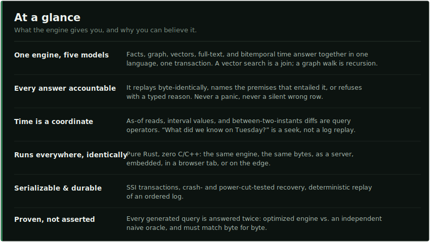

> LLMs gave software the ability to think out loud. KyzoDB exists so that what such systems come to
> know can be held: exactly, durably, explainably, and identically every time it's asked for. Not the
> mind; the ground the mind stands on.

## Benchmarks

KyzoDB will be measured on the same public yardsticks its neighbours publish, one per access pattern
it collapses into a single engine. Numbers land here as they are measured, with methodology, hardware,
seeds, and the losing runs alongside the winning ones. Nothing enters this table that has not been
reproduced.

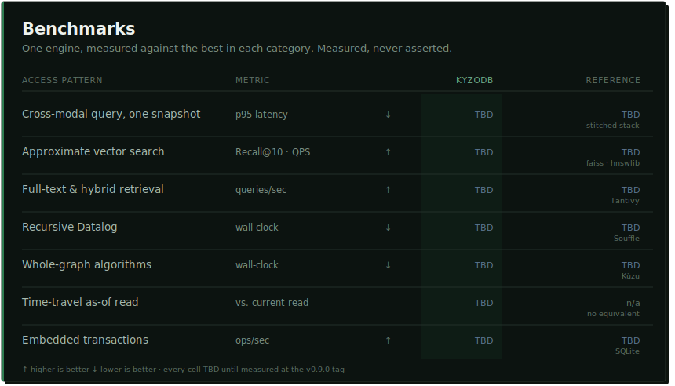

The point of one engine is that these are not five products' scores stapled together: they are one
store, one transaction model, and one memcomparable keyspace, measured five ways.

## One query, all of memory

Here is the shape nothing stitched together can match: a recursive graph reach, a semantic vector
search *restricted to* that reach, and a provenance join, evaluated at one transactional cut *in the
past*, under a budget that can refuse. Below, a clinical agent asks it as one question, before it
recommends a drug: which known adverse events resemble this patient's symptom, among only the drugs
they are on or interact with, with the evidence exactly as the record stood at admission:

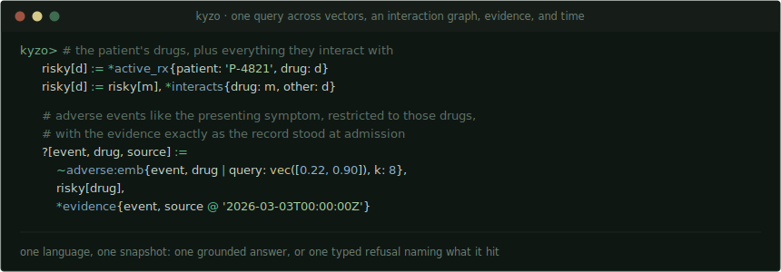

One language, one snapshot, one answer, and if the traversal overspends its budget, one typed
refusal naming exactly what it hit. That single block *is* the thesis: retrieval that is composable
and auditable, not a fan-out pipeline whose five copies of the truth drift apart. Everything below is
the set of decisions that make that query honest, because you cannot evaluate an engine from its
feature list, and we would not ask you to.

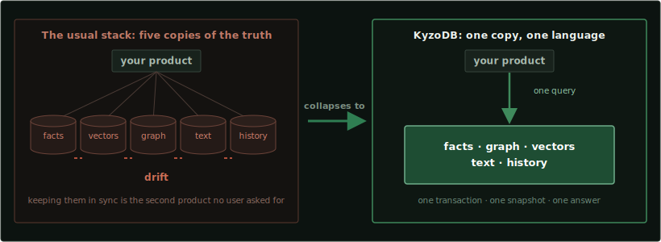

## Using KyzoDB

It runs embedded: in your process, like SQLite, no server and no setup. Add the dependency and open a
database in a couple of lines:

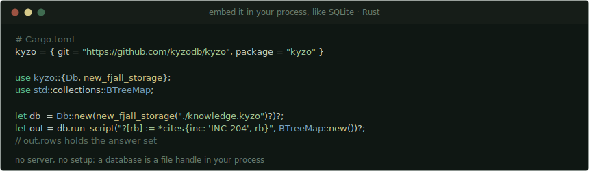

That path is a durable, crash-safe store; point it at a fresh temp directory for an ephemeral one. To
build the workspace itself (stable Rust, nothing else):

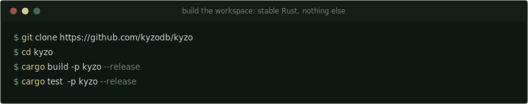

Language bindings (C, Python, Java, Node, Swift, WASM, with Go, Clojure, and Android in separate
repos) are being ported and published under KyzoDB; the [issues](https://github.com/kyzodb/kyzo/issues)
track each one.

## Retrieval is one act

The retrieval paths a knowledge system usually spreads across five services are ordinary relations
here, so they combine in a single query.

Take an agent's memory of past incidents, each carrying a short summary and a vector embedding, plus a
relation recording which incident cites which runbook:

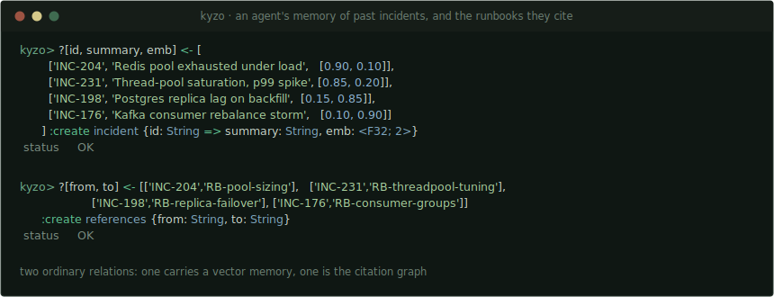

Then index that one relation three ways: dense vectors with HNSW, full text, and near-duplicates with
MinHash-LSH.

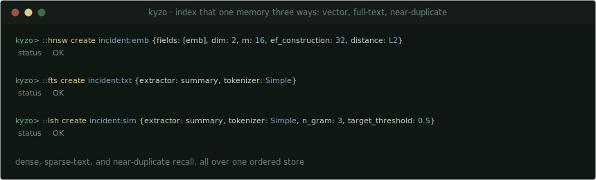

A nearest-neighbour search binds with `~` and unifies like any other relation. Joined straight to
`references`, one query recalls the incidents that most resemble a live alert and then follows to the
runbooks they cite:

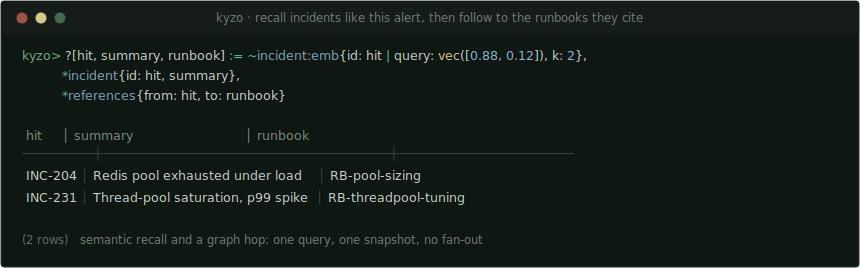

Full text answers `~incident:txt{id | query: 'pool', k: 5}` and near-duplicates answer
`~incident:sim{id | query: 'Redis pool exhausted under load', k: 5}`; in every case the search result is
a relation you can join, filter, negate, and recurse over. Hybrid retrieval is a query, not a pipeline:
there is no fan-out layer, no re-ranking glue service, and no copy of your data waiting to drift.

And because search here is an engine capability rather than a bolted-on service, it makes guarantees
that services do not make:

- **Filtered vector search that cannot come back empty.** Anyone who has run a vector database knows
  this failure: add a filter, and the nearest neighbours silently vanish, because the index gathered
  its `k` candidates before the filter ran. (Measured on the naive approach: zero of the ten true
  nearest returned at 1% selectivity.) KyzoDB estimates the filter's selectivity and selects between
  an exact scan, filtered graph traversal, and oversampled post-filtering, deterministically, from
  the data alone, never from timing. The guarantee is exact: `min(k, matches)` results at every
  selectivity. The strategy design builds on published
  [Qdrant research](https://qdrant.tech/articles/vector-search-filtering/).
- **Sparse vectors on the same substrate.** SPLADE-class learned sparse retrieval as an inverted
  index over the same ordered store, so dense, sparse, and full-text hybrid retrieval is a join, not
  a fusion microservice. Rank fusion across text, vector, and graph scores is an operator in the
  query, not a re-ranking layer behind it.
- **Entity tagging without a model.** The deterministic cousin of NER: every entity already in your
  graph, found in a document by exact multi-pattern matching, returned as a relation with byte-exact
  spans. Text-to-graph in one query. And when a surface form is ambiguous ("Washington" the state,
  the president, the city), the tagger does not guess: it emits one tag per candidate entity and
  lets a downstream join resolve the ambiguity, because resolving ambiguity against known facts is
  exactly what a join is for. A search service cannot compose this with your graph, and a model
  cannot do it reproducibly.
- **Geospatial through the same funnel.** Space-filling curves encode 2D proximity directly into the
  ordered keys, so bounding boxes, containment, and geo-kNN are ordinary range scans, like every
  other access path in the engine.
- **Search results that replay.** Equal-distance ties break on a total order, and strategy selection
  depends only on the data, so the same database answers the same search byte-identically on any
  machine, at any thread count, on any run. Approximate search engines do not make this guarantee.
  It is what lets a retrieval layer live inside a test suite.

Further capabilities land in this same shape and are held to the same bar: a deterministic pure
algorithm, composable with the query language, proven under the same laws. What comes next lives in
the open, on the [roadmap](https://github.com/orgs/kyzodb/projects/2).

## Recursion is native

The query language is Datalog, in a dialect called **KyzoScript**. Datalog expresses everything
relational algebra can, and it makes recursion a first-class, composable construct rather than SQL's
bolted-on `WITH RECURSIVE`. Rules compose like functions: you build a query piece by piece, and
decomposition costs nothing.

If you can write a SQL join, the rule form below is a day's acclimation, and the payoff arrives the
first time a query that would have been an eleven-line recursive CTE is three lines that read top to
bottom.

Here `*can_access` is an access graph: which principal can reach which resource. Every resource a
compromised service account can reach, by any number of hops, is three lines, and the second rule
feeds on itself. That set is the blast radius, and it names the crown-jewel database at the end of it:

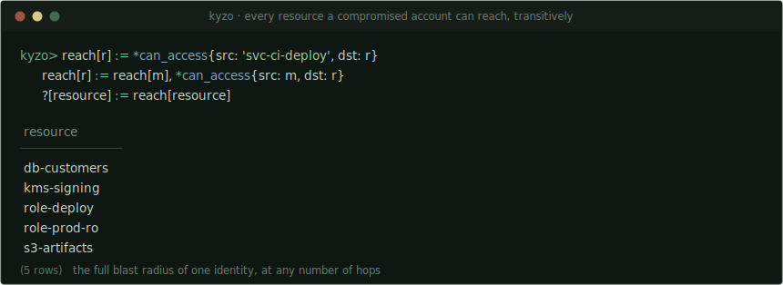

For the recursions that graph analysis reaches for constantly, the engine ships whole-graph algorithms
(PageRank, community detection, shortest paths, centralities, max-flow, k-core, maximal cliques, and
more) as built-in rules over your relations, with no export to a graph runtime and back:

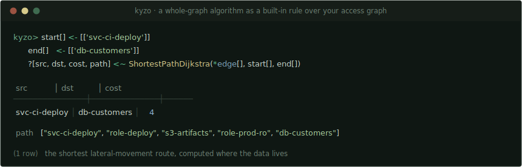

And because vector and text search results are relations too, they feed these same recursions: a
similarity hit can seed a graph traversal in the query that found it.

## Time is a coordinate, not a feature

Every relation is bitemporal, not as an option but as the format. Writes never destroy: an
update supersedes, a deletion retracts, and a correction revises the record without erasing what it
used to say. Two time axes ride in every stored fact: *valid time* (when the fact holds in the
world, assertable per row, including retroactively) and *system time* (when the record came to say
so, engine-stamped, with no API that can forge it). Any query can then be evaluated *as of* either or
both: `@ instant` asks what currently-believed facts held at an instant; `@ system, instant` asks
what the record itself said at a past moment about that instant. *"What did we know on Tuesday?"* is a
parameter of the read, not an archaeology project over change-data-capture logs.

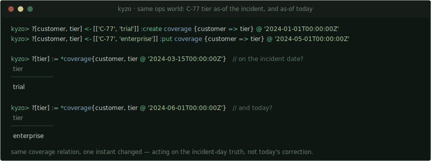

Under the hood, both timestamps live in the storage key itself, so an as-of read is an ordinary
seek-based ordered scan, not a reconstruction, and it composes: joins, recursion, negation, and
aggregation all evaluate at a coordinate, and plain indexes carry the same coordinates as their base
rows, so an as-of read through an index answers exactly like the base.

**We never store an interval.** Every system that stores time *ranges* inherits the same family of
wounds the SQL:2011 lineage documented for a generation: a write covering part of an existing period
splits one row into three, coalescing is optional so two identical histories differ byte-wise, and a
`PERIOD` is not a value so temporal meaning dies at the first projection. KyzoDB stores only point
events; an interval is *derived at read time* as the maximal constant runs of the resolution
function. Coalescing is therefore not an operation that can be forgotten: it is the definition, and
un-coalesced output cannot exist. Intervals surface as first-class values that survive projection
through rules, with Allen's relations as ordinary predicates, and a diff between two instants obeys an
algebraic law (`diff(a,c) = diff(a,b) ⊕ diff(b,c)`) that runs in the test suite.

Retraction is revision, not erasure: what a system believed, when it came to believe it, when it
stopped, and when the record itself was corrected all remain queryable. For software that accumulates
knowledge over time, that distinction is the difference between a memory and a cache.

## The engine keeps its word

These are the properties that separate a component you build on from a component you babysit. Each is
a capability you get; the line under it is the mechanism that makes it true, because a guarantee no
one enforces is a wish.

- **Determinism: a query is a test.** The same facts, the same query, and the same budget produce
  identical answers *and* identical refusals, on every run, at any thread count, on any machine.
  *Enforced by* seeded campaigns that evaluate generated programs (deep recursion, negation,
  aggregation lattices) at 1, 2, 4, and 8 threads and demand byte-identical answers, witness tables,
  and refusals; the build goes red otherwise. This is what lets a fixture assert an exact answer in
  CI forever, and lets a production incident replay exactly.
- **Refusals that explain themselves.** Ask a question the data cannot safely answer (a wrong query,
  an exceeded budget, an unsafe program shape) and you get a *typed* error naming the reason and
  pointing at the exact span of the script, never a panic and never a wrong row. *Enforced by* a
  refusal corpus run against the real stratifier and compiler, and by generative fuzzing that assumes
  a brilliant, adversarial, unbounded caller. An error message is an interface, and increasingly its
  reader is a program.
- **Budgeted execution.** Evaluation runs under explicit ceilings (epochs, derived tuples, in-flight
  materialization, deadlines) and exceeding one yields a typed, deterministic refusal that names the
  budget it hit, rather than a runaway query or a silent kill. A runaway traversal cannot take down a
  shared runtime; a plan limit surfaces as an inspectable, replayable statement of what was exceeded.
- **Answers that show their work.** Provenance is built into evaluation, not bolted on: a derived
  fact names the rule and premises that entailed it, recursively down to stored ground facts. *"Why
  do you believe that?"* becomes a query. *Enforced by* an independent checker that imports nothing
  from the evaluator and re-derives every step from the rules and ground facts alone, and whose
  structure cannot represent a cyclic proof.

There is one more reason to hold these lines, and it is economic. The cheaper the model calling the
database, the less ambiguity it can absorb: a frontier model can paper over a vague error or an
inconsistent answer, a small one cannot. Typed refusals, deterministic results, and computable
provenance are the feedback interface that lets modest models work reliably. A database that is never
ambiguous is what makes the intelligence above it affordable.

## Why you can believe all of that

Every claim above is a testable law, and the centerpiece of the enforcement is differential: KyzoDB
ships **its own adversary.** Inside it lives a second, deliberately naive evaluator (too slow to ever
be worth optimizing, and therefore easy to audit) that speaks the *entire* language: recursion,
stratified negation, aggregation, and time. Every generated workload is answered twice, and the two
answers must be byte-identical.

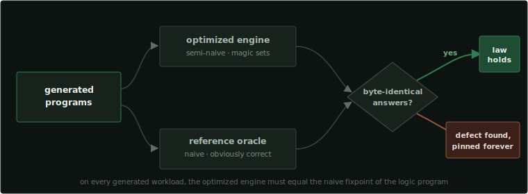

The query engine's front door (`crates/kyzo-core/src/query/mod.rs`) opens with **seven numbered laws**, each
documented with the mechanism that enforces it: answer correctness (optimized evaluation must equal
the naive fixpoint), stratification safety (unsound programs are refused, never mis-answered),
termination, rule safety, total input handling (no query text and no stored bytes may panic the
process), concurrency liveness, and operator coherence (an index search is a relation, full stop).
The rest of the machinery holds them to it:

- **A reference oracle** (`query/laws.rs`): an ~1,800-line executable statement of stratified Datalog
  semantics, deliberately naive so it is obviously correct, compiled only into test builds.
- **`::verify` as a user surface.** The adversary is not just lab equipment: verify mode runs your
  query through both evaluators against one snapshot and returns a match, a budgeted refusal, or a
  reproducible mismatch bundle. A database that can be *asked to prove an answer* is the next table
  stake. We are setting it.
- **Proofs checked by an outsider.** A derived fact names the rules and ground facts that entailed
  it, verified by a checker that imports nothing from the evaluator. On a determination an agent
  cannot afford to get wrong, that reads like this (the values illustrate the shape your own rules
  would fill in):

  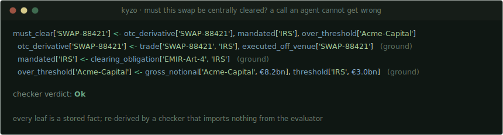

  The proof is reconstructed from the evaluator's own witnesses and re-derived independently. The
  checker rejects corrupted proofs, and its structure cannot represent a cyclic one.
- **Deterministic simulation testing** (`storage/sim.rs`): a second implementation of the storage
  contract in which thread interleavings, injected faults, crashes, and power cuts are all a pure
  function of one `u64` seed. A failing campaign prints its seed; rerunning replays the failure
  exactly.
- **Mutation testing** sabotages the code under test and checks that some test notices. When a
  mutation once survived the whole suite because a provenance guarantee happened to hold with no test
  asserting it, the missing test was written before the change landed.
- **Adversarial review.** No change lands on the strength of its author's report: reviewers re-derive
  pinned fixtures independently and run their own campaigns against bases the author never touched.
  One such sweep, ten thousand records wide, caught a one-microsecond rounding difference headed for
  the time-travel key encoding; the resolution restored exact behavior rather than documenting the
  drift.
- **Generative fuzzing** of the parser and query language, and a **defect ledger**: dozens of defects
  inherited from the fork base, including silent-wrong-answer bugs in recursive evaluation, were
  found by these instruments, fixed, and pinned as regression tests rather than carried forward.

Performance numbers will be published the same way: with methodology, hardware, seeds, and the losing
runs, against the standard public yardsticks for each capability.

## One substrate, no ballast

The architecture is three layers, each calling only into the one below. The whole system rests on one
idea: every retrieval modality, however exotic it looks at the query level, becomes an ordered range
scan by the time it reaches storage.

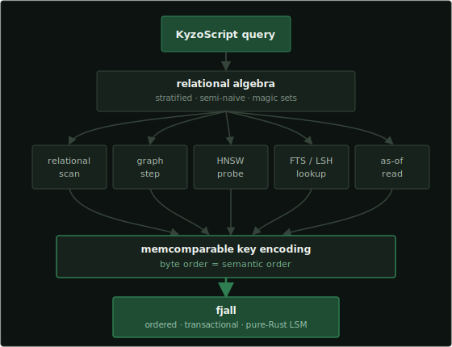

**Storage.** A `Storage` trait defines an ordered key-value store with range scans, MVCC commit
semantics, and validity-in-key as-of reads. The implementation is [`fjall`](https://github.com/fjall-rs/fjall),
a pure-Rust LSM store. Rows are encoded with a
[memcomparable format](https://github.com/facebook/mysql-5.6/wiki/MyRocks-record-format#memcomparable-format):
binary blobs whose lexicographic order *is* their semantic order. That single invariant is why one
dumb ordered store can serve relational scans, graph traversals, vector and text index lookups, and
time travel uniformly: every access path above is just a range scan below. Break the order embedding
anywhere and joins silently return wrong rows (no error, no panic, just wrong), so the encoding is
the most heavily attacked code we have, and any change to it is a versioned format migration that
stores and dumps refuse to cross.

**Query engine.** KyzoScript compiles to relational algebra and evaluates with semi-naive, stratified,
magic-set Datalog. Schema, transactions, functions, aggregations, algorithms, and the index operators
live here. Rust programs call this API directly.

**Wrappers.** Every other language gets a thin FFI layer over the Rust API: a C ABI, Python (pyo3),
Java (jni), Node (neon), Swift (swift-bridge), WASM (wasm-bindgen).

## Pure Rust is operational, not aesthetic

The whole engine and server build as **pure Rust, with no C or C++ anywhere in the toolchain**:
enforced in CI as a class ban on the dependency tree, not a lint: a dependency that brings in a C
compiler fails the build. The payoff is concrete. One `cargo build` on any platform Rust supports.
One compiler's memory model, one supply chain to audit, no vendored C++ submodule breaking on next
year's compiler, and backups in a pure-Rust portable format. Fuzzers and sanitizers see every
instruction; there is no FFI shadow where the interesting bugs hide. And the same engine, byte for
byte, runs as a server, embedded, in a browser tab against OPFS, and on edge runtimes where
deterministic replay of the event log *is* the persistence layer, which is why "runs identically on
a Raspberry Pi" is a test we automate, not a demo we rehearse. (When the time library's platform
stack (an Apple C shim, Android's libc bindings, the windows-core family) turned up in the
dependency lock, it was migrated out to pure-Rust replacements, every behavior delta pinned as a
permanent regression fixture.)

## Many small graphs

What happens when the knowledge outgrows one place? KyzoDB's answer to scale is not a bigger database;
it is more of them. Real knowledge does not arrive as one mega-graph. It arrives as domains: this
team's ontology, that product's catalog, one agent's accumulated history, each with its own
governance, its own consistency needs, and its own blast radius. The deployment model this engine is
built toward is a graph of many small graphs: instances small enough to be owned and audited, composed
above rather than fused below.

Three properties already in the engine make that topology cheap:

- **Instances are nearly free.** An embedded database with no server means a graph costs a file
  handle, not a deployment.
- **Graphs are portable.** The pure-Rust dump/restore format gives every instance an interchange
  shape: a graph can move hosts, fork for an experiment, or archive as a single artifact.
- **Replicas are interchangeable.** Two instances that ingest the same facts in the same order answer
  byte-identically: replication here is replay of an ordered log, and determinism is what makes the
  replay provably equivalent.

Query composition across graphs is direction, not shipped capability, and the line of ownership is
drawn now: the *meaning* of a cross-graph query belongs to this engine, in the open. How graphs are
addressed, how answers compose, what determinism and provenance guarantee when a derivation crosses a
graph boundary: these are engine semantics, and they will be specified, law-tested, and documented
here the same way the seven engine laws are. An open protocol is what makes a federated graph
trustworthy; a graph you can only interpret through one vendor's fabric is not federated, it is
captured.

## What KyzoDB is not

KyzoDB is not where you put petabyte-scale analytics; columnar warehouses own that. It is not a
distributed OLTP system; it scales like the excellent embedded engines do, not like a cluster. And if
all you need is a key-value cache or a single denormalized table, this is more machine than the job
requires. KyzoDB is for the case where one body of knowledge must answer as facts, as a graph, as
similarity, as text, and as history, consistently, accountably, and in one place.

## Status

KyzoDB's first public release is **0.9.0**. The engine is feature-complete for its scope and its core
guarantees are proven: serializable transactions, crash- and power-cut recovery, an oracle-verified
query semantics across relational, graph, vector, full-text, and bitemporal queries, a shipped
`::verify` self-check, and live standing views: the full surface answers end-to-end on the real
server. It is still pre-1.0 and under active development, so expect churn: the public API is not
frozen and performance is not yet verified at scale, which is exactly why this is 0.9.0 and not 1.0.
See [VERSIONING.md](VERSIONING.md). The [board](https://github.com/kyzodb/kyzo/issues) is the live
status.

## Origins

KyzoDB began as a fork of [CozoDB](https://github.com/cozodb/cozo) by Ziyang Hu and the Cozo Project
Authors, whose design proved the one-substrate thesis was worth betting on; the full story and
attribution live in [FORK.md](FORK.md).

## Links

* [Repository](https://github.com/kyzodb/kyzo)
* [Roadmap](https://github.com/orgs/kyzodb/projects/2)
* [Issues and board](https://github.com/kyzodb/kyzo/issues)
* [VERSIONING.md](VERSIONING.md) · [CONTRIBUTING.md](CONTRIBUTING.md)
* [FORK.md](FORK.md) (origins and attribution)

## License

KyzoDB is multi-licensed; [LICENSING.md](LICENSING.md) is the authoritative map. The database engine
and its hosts are [**MPL-2.0**](LICENSE-MPL) — KyzoDB is a fork of CozoDB, and the MPL is inherited
from that lineage and preserved per file (see [FORK.md](FORK.md)). The agent-development and
tooling — `.claude/` —
is [**BSL-1.1**](LICENSE-BSL): free to use, modify, and build on for any non-production purpose, not
for hosted or commercial resale, and it converts to MPL-2.0 on the Change Date. Every license header
and copyright notice from the work it builds on is preserved, and incorporated contributor fixes keep
their original authorship. The project is not accepting external code contributions right now; see
[CONTRIBUTING.md](CONTRIBUTING.md).
</content>
</invoke>
