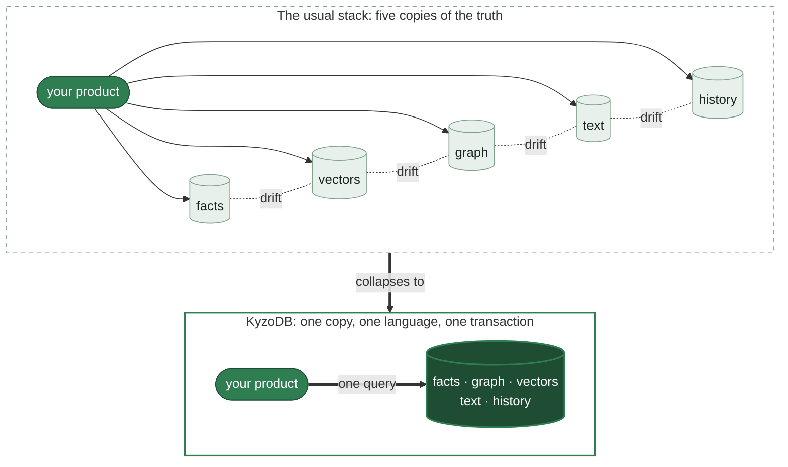
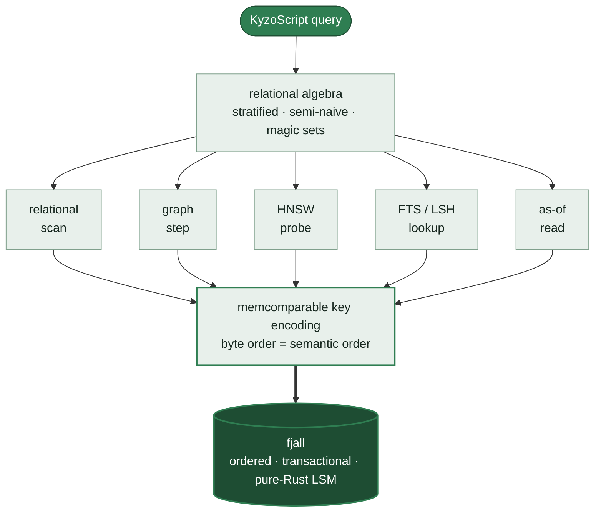
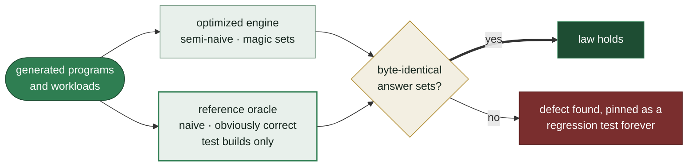

<p align="center">
  
</p>

<h1 align="center">KyzoDB</h1>

<p align="center"><em>One deterministic database for facts, graphs, vectors, text, and time.</em></p>

<p align="center">
  <a href="LICENSE.txt"></a>
  <a href="https://github.com/kyzodb/kyzo/issues"></a>
</p>

> [!WARNING]
> **Under construction.** This README describes the target state of an in-flight rebuild. The
> [board](https://github.com/orgs/kyzodb/projects/1) is the live status.

If you are building a knowledge-heavy product today, you usually end up spreading one domain across
five systems: Postgres for facts, a vector database for similarity, a graph store for relationships, a
search engine for text, and some history layer bolted on. Now you have a second product to build, one
no user asked for: keeping five copies of the truth synchronized, and explaining yourself when they
disagree.

KyzoDB collapses that into one embeddable, transactional database. Facts, relationships, semantic
similarity, text, near-duplicates, and historical state answer together, in one language, in one
transaction. A vector search is a join. A graph traversal is recursion. A read at a past instant is a
query parameter.

The point is not vector search inside a database; that is becoming table stakes. The point is that
retrieval becomes composable and auditable: a semantic hit can join to structured facts, walk a graph,
respect time, and explain why the answer exists. The same query over the same facts returns the same
answer, and fails with the same refusal, every time. A deliberately naive implementation of the query
semantics exists as the specification, and the optimized engine must match it, byte for byte, across
generated workloads. The bottom half of this document is about that.

> LLMs gave software the ability to think out loud. KyzoDB exists so that what such systems come to
> know can be held: exactly, durably, explainably, and identically every time it's asked for. Not the
> mind; the ground the mind stands on.



## Retrieval is one act

The retrieval paths a knowledge system usually spreads across five services are ordinary relations
here, so they combine in a single query.

Take documents that carry a title and a vector embedding, plus a relation recording which document
cites which:

```prolog
?[id, title, emb] <- [
    ['graph-db',   'Graph databases',       [0.1,  0.9]],
    ['vec-search', 'Vector search',         [0.9,  0.1]],
    ['datalog',    'Datalog and recursion', [0.15, 0.85]],
    ['mvcc',       'Transactions and MVCC', [0.85, 0.2]]
]
:create doc {id: String => title: String, emb: <F32; 2>}

?[from, to] <- [['datalog', 'graph-db'], ['graph-db', 'mvcc'], ['vec-search', 'datalog']]
:create cites {from: String, to: String}
```

Index the embeddings with HNSW:

```prolog
::hnsw create doc:emb {dim: 2, dtype: F32, fields: [emb], distance: L2, m: 50, ef_construction: 20}
```

A nearest-neighbour search binds with `~` and unifies like any other relation. Joined straight to
`cites`, one query performs semantic recall and then follows the relationships of whatever it finds:

```prolog
?[hit, title, cited] := ~doc:emb{id: hit, title | query: q, k: 2, ef: 20},
                        *cites{from: hit, to: cited},
                        q = vec([0.12, 0.88])
```

| hit      | title                  | cited    |
|----------|------------------------|----------|
| datalog  | Datalog and recursion  | graph-db |
| graph-db | Graph databases        | mvcc     |

Full-text and near-duplicate search take the same shape. A full-text index over the same titles:

```prolog
::fts create doc:text {extractor: title, tokenizer: Simple, filters: [Lowercase, Stemmer('English'), Stopwords('en')]}
```

answers `~doc:text{id, title | query: 'graph', k: 5}`. A MinHash-LSH index for
near-duplicates:

```prolog
::lsh create doc:lsh {extractor: title, tokenizer: NGram, n_gram: 3, target_threshold: 0.5}
```

answers `~doc:lsh{id | query: 'Graph databases', k: 5}`. In every case the search result is a relation
you can join, filter, negate, and recurse over. Hybrid retrieval is a query, not a pipeline: there is
no fan-out layer, no re-ranking glue service, and no copy of your data waiting to drift.

And because search here is an engine capability rather than a bolted-on service, it makes guarantees
that services do not make:

- **Filtered vector search that cannot come back empty.** Anyone who has run a vector database knows
  this failure: add a filter, and the nearest neighbours silently vanish, because the index gathered
  its `k` candidates before the filter ran. (Measured on the naive approach: zero of the ten true
  nearest returned at 1% selectivity.) KyzoDB estimates the filter's selectivity and selects between
  an exact scan, filtered graph traversal, and oversampled post-filtering, deterministically, from
  the data alone, never from timing. The guarantee is exact: `min(k, matches)` results at every
  selectivity. The strategy design builds on published
  [Qdrant research](https://qdrant.tech/articles/vector-search-filtering/).
- **Sparse vectors on the same substrate.** SPLADE-class learned sparse retrieval as an inverted
  index over the same ordered store, so dense, sparse, and full-text hybrid retrieval is a join, not
  a fusion microservice. Rank fusion across text, vector, and graph scores is an operator in the
  query, not a re-ranking layer behind it.
- **Entity tagging without a model.** The deterministic cousin of NER: every entity already in your
  graph, found in a document by exact multi-pattern matching, returned as a relation with byte-exact
  spans. Text-to-graph in one query. And when a surface form is ambiguous ("Washington" the state,
  the president, the city), the tagger does not guess: it emits one tag per candidate entity and
  lets a downstream join resolve the ambiguity, because resolving ambiguity against known facts is
  exactly what a join is for. A search service cannot compose this with your graph, and a model
  cannot do it reproducibly.
- **Geospatial through the same funnel.** Space-filling curves encode 2D proximity directly into the
  ordered keys, so bounding boxes, containment, and geo-kNN are ordinary range scans, like every
  other access path in the engine.
- **Search results that replay.** Equal-distance ties break on a total order, and strategy selection
  depends only on the data, so the same database answers the same search byte-identically on any
  machine, at any thread count, on any run. Approximate search engines do not make this guarantee.
  It is what lets a retrieval layer live inside a test suite.

Further capabilities land in this same shape and are held to the same bar: a deterministic pure
algorithm, composable with the query language, proven under the same laws. What comes next lives in
the open, on the [roadmap](https://github.com/orgs/kyzodb/projects/2).

## Recursion is native

The query language is Datalog, in a dialect called **KyzoScript**. Datalog expresses everything
relational algebra can, and it makes recursion a first-class, composable construct rather than SQL's
bolted-on `WITH RECURSIVE`. Rules compose like functions: you build a query piece by piece, and
decomposition costs nothing.

If you can write a SQL join, the rule form below is a day's acclimation, and the payoff arrives the
first time a query that would have been an eleven-line recursive CTE is three lines that read top to
bottom.

Here `*route` is a relation of airport-to-airport routes, and `FRA` is Frankfurt. Every airport
reachable from Frankfurt, by any number of stops, is three lines:

```prolog
reachable[to] := *route{fr: 'FRA', to}
reachable[to] := reachable[stop], *route{fr: stop, to}
?[count_unique(to)] := reachable[to]
```

| count_unique(to) |
|------------------|
| 3462             |

For the recursions that graph analysis reaches for constantly, the engine ships whole-graph algorithms
(PageRank, community detection, shortest paths, centralities, max-flow, k-core, maximal cliques, and
more) as built-in rules over your relations, with no export to a graph runtime and back:

```prolog
start[] <- [['FRA']]
end[] <- [['YPO']]
?[src, dst, distance, path] <~ ShortestPathDijkstra(*route[], start[], end[])
```

| src | dst | distance | path                              |
|-----|-----|----------|-----------------------------------|
| FRA | YPO | 4544.0   | `["FRA","YUL","YVO", ... ,"YPO"]` |

And because vector and text search results are relations too, they feed these same recursions: a
similarity hit can seed a graph traversal in the query that found it.

## Time is a query parameter

Every relation is bitemporal — not as an option, but as the format. Writes never destroy: an
update supersedes, a deletion retracts, and a correction revises the record without erasing what it
used to say. Two time axes ride in every stored fact: *valid time* (when the fact holds in the
world) and *system time* (when the record came to say so). Any query can then be evaluated *as of*
either or both — `@ instant` asks what currently-believed facts held at an instant; `@ system,
instant` asks what the record itself said at a past moment about that instant. "What did we know on
Tuesday?" is a parameter of the read, not an archaeology project over change-data-capture logs.

Under the hood, both timestamps live in the storage key itself, so an as-of read is an ordinary
seek-based ordered scan, not a reconstruction — and it composes: joins, recursion, negation, and
aggregation all evaluate at a coordinate, and plain indexes carry the same coordinates as their base
rows, so an as-of read through an index answers exactly like the base.

Retraction is revision, not erasure: what a system believed, when it came to believe it, when it
stopped believing it, and when the record itself was corrected all remain queryable. For software
that accumulates knowledge over time, that distinction is the difference between a memory and a
cache.

## The engine keeps its word

These are the properties that separate a component you build on from a component you babysit. How
they are enforced is the subject of [How it is tested](#how-it-is-tested) below; here is what they
mean:

- **Determinism as a law.** The same facts, the same query, and the same execution budget produce
  identical answers, and identical refusals, on every run, at any thread count, on any machine. This
  is what makes a retrieval layer testable: fixture data and a query assert an exact answer in CI
  forever, and a production incident replays exactly.
- **Refusals that explain themselves.** Where the query is wrong, the engine answers with a typed error
  naming the reason and pointing at the exact span of the script: never a panic, never a shrug. An
  error message is an interface, and increasingly its reader is a program.
- **Budgeted execution.** Evaluation runs under an explicit budget of derivation ceilings and
  deadlines, and exceeding it yields a typed, deterministic refusal rather than a runaway query or a
  silent kill.
- **Answers that show their work.** Provenance is built into evaluation, not bolted on: a derived
  fact names the rule and premises that entailed it, recursively down to stored ground facts, and the
  resulting proof tree is verified by an independent checker that imports nothing from the evaluator.
  "Why do you believe that" becomes a query. Negation is closed-world and not proof-checkable, and
  aggregations and built-in algorithms are admitted as steps, not derived per row.

There is one more reason to hold these lines, and it is economic. The cheaper the model calling the
database, the less ambiguity it can absorb: a frontier model can paper over a vague error or an
inconsistent answer, a small one cannot. Typed refusals, deterministic results, and computable
provenance are the feedback interface that lets modest models work reliably. A database that is never
ambiguous is what makes the intelligence above it affordable.

## One substrate, no ballast

The architecture is three layers, each calling only into the one below. The whole system rests on one
idea: every retrieval modality, however exotic it looks at the query level, becomes an ordered range
scan by the time it reaches storage.



**Storage.** A `Storage` trait defines an ordered key-value store with range scans, MVCC commit
semantics, and validity-in-key as-of reads. The implementation is [`fjall`](https://github.com/fjall-rs/fjall),
a pure-Rust LSM store. Rows are encoded with a
[memcomparable format](https://github.com/facebook/mysql-5.6/wiki/MyRocks-record-format#memcomparable-format):
binary blobs whose lexicographic order *is* their semantic order. That single invariant is why one dumb
ordered store can serve relational scans, graph traversals, vector and text index lookups, and time
travel uniformly: every access path above is just a range scan below.

**Query engine.** KyzoScript compiles to relational algebra and evaluates with semi-naive, stratified,
magic-set Datalog. Schema, transactions, functions, aggregations, algorithms, and the index operators
live here. Rust programs call this API directly.

**Wrappers.** Every other language gets a thin FFI layer over the Rust API: a C ABI, Python (pyo3),
Java (jni), Node (neon), Swift (swift-bridge), WASM (wasm-bindgen).

The whole engine and server build as **pure Rust, with no C or C++ anywhere in the toolchain**: one
`cargo build` on any platform Rust supports, one compiler's memory model, one supply chain to audit,
no vendored C++ submodule breaking on next year's compiler, and backups in a pure-Rust portable
format. CI enforces it: a dependency that brings in a C compiler fails the build. When the time
library's platform stack (an Apple C shim, Android's libc bindings, the windows-core family) was
found in the dependency lock, it was migrated out in favor of pure-Rust replacements, with every
behavior delta pinned as a permanent regression fixture.

## How it is tested

Every change is built, then reviewed by a second party briefed to refute it, and lands only when the
refutation fails. The tests go through the same gate as the code. The
[board](https://github.com/orgs/kyzodb/projects/1) is the live record.

The query engine's front door (`kyzo-core/src/query/mod.rs`) opens with **seven numbered laws**, each
documented with the mechanism that enforces it: answer correctness (optimized evaluation must equal the
naive fixpoint of the logic program), stratification safety (unsound programs are refused, never
mis-answered), termination, rule safety, total input handling (no query text and no stored bytes may
panic the process), concurrency liveness, and operator coherence (an index search is a relation, full
stop).

The centerpiece of the enforcement is differential: every generated workload is answered twice, once
by the optimized engine and once by the naive reference, and the two answers must be byte-identical.



The rest of the machinery:

- **A reference oracle** (`query/laws.rs`): an 1,800-line executable statement of stratified Datalog
  semantics, deliberately naive so it is obviously correct, compiled only into test builds.
- **The determinism law as a campaign.** Seeded campaigns of generated programs (deep recursion,
  negation, the aggregation lattices, thousands of facts), each evaluated at 1, 2, 4, and 8 threads
  under finite budgets: byte-identical answers, byte-identical witness tables, byte-identical
  refusals. The campaign is run twice: once by its author, and again by its reviewer with fresh
  seeds on a base the author never touched. Sabotaging the engine's negation handling makes the
  seeds fail loudly, and the generated programs are measured to require real fixpoint work (nearly
  all take multiple evaluation epochs), so a pass on toy queries is not possible.
- **Proofs checked by an outsider.** "Why do you believe that" is answered with an artifact, not a
  log line. From the provenance campaign in the test suite:

      labeled[1,100] <- path[1,4], tag[4,100]
        path[1,4] <- edge[1,2], path[2,4]
          path[2,4] <- edge[2,3], path[3,4]
            path[3,4] <- edge[3,4]   (ground)
      checker verdict: Ok

  That tree was reconstructed from the evaluator's own witnesses, then verified by an independent
  checker that imports nothing from the evaluator: it re-derives every step from the rules and ground
  facts alone. The checker rejects corrupted proofs, and its structure cannot represent a cyclic
  proof.
- **Deterministic simulation testing** (`storage/sim.rs`): a second implementation of the storage
  contract in which thread interleavings, injected faults, crashes, and power cuts are all a pure
  function of one `u64` seed. A failing campaign prints its seed; rerunning replays the failure
  exactly.
- **Mutation testing** sabotages the code under test and checks that some test notices. When a
  mutation once survived the whole suite because a provenance guarantee happened to hold with no
  test asserting it, the missing test was written before the change landed.
- **Adversarial review.** No change lands on the strength of its author's report: reviewers
  re-derive pinned fixtures independently and run their own campaigns against bases the author never
  touched. One such sweep, ten thousand records wide, caught a one-microsecond rounding difference
  headed for the time-travel key encoding; the resolution restored exact behavior rather than
  documenting the drift. What these reviews catch is rarely broken engine semantics. It is the two
  quieter failures no green test suite reports: tests that pass without protecting anything, and
  reports that claim more than their evidence.
- **Generative fuzzing** of the parser and query language assumes a caller that is brilliant,
  adversarial, and unbounded: the engine must never panic, and every refusal must name its reason and
  its span.
- **A defect ledger.** Dozens of defects inherited from the fork base, including silent-wrong-answer
  bugs in recursive evaluation, were found by these instruments, fixed, and pinned with regression
  tests rather than carried forward.

Performance numbers will be published the same way: with methodology, hardware, seeds, and the losing
runs, against the standard public yardsticks for each capability.

## Using KyzoDB

It runs embedded: in your process, like SQLite, no server and no setup. Open a database and query it in
two lines:

```rust
use kyzo::DbInstance;

let db = DbInstance::new("mem", "", Default::default())?;
let result = db.run_default("?[reachable] := *route{fr: 'FRA', to: reachable}")?;
```

Swap `"mem"` for the persistent engine and a path when you want durability; run it client-server when
you want shared access and more concurrency. To depend on it from a Rust project:

```toml
kyzo = { git = "https://github.com/kyzodb/kyzo", package = "kyzo" }
```

To build the workspace itself (stable Rust, nothing else):

```bash
git clone https://github.com/kyzodb/kyzo
cd kyzo
cargo build -p kyzo --release
cargo test  -p kyzo --release
```

Language bindings (C, Python, Java, Node, Swift, WASM, with Go, Clojure, and Android in separate repos)
are being ported and published under KyzoDB; the [issues](https://github.com/kyzodb/kyzo/issues) track
each one.

## What KyzoDB is not

KyzoDB is not where you put petabyte-scale analytics; columnar warehouses
own that. It is not a distributed OLTP system; it scales like the excellent embedded engines do, not
like a cluster. And if all you need is a key-value cache or a single denormalized table, this is more
machine than the job requires. KyzoDB is for the case where one body of knowledge must answer as facts,
as a graph, as similarity, as text, and as history, consistently and in one place.

## Many small graphs

Which raises the fair question: what happens when the knowledge outgrows one place? KyzoDB's answer to
scale is not a bigger database; it is more of them. Real knowledge does not arrive as one mega-graph.
It arrives as domains: this team's ontology, that product's catalog, one agent's accumulated history,
each with its own governance, its own consistency needs, and its own blast radius. The deployment model
this engine is built toward is a graph of many small graphs: instances small enough to be owned and
audited, composed above rather than fused below.

Three properties already in the engine make that topology cheap:

- **Instances are nearly free.** An embedded database with no server means a graph costs a file handle,
  not a deployment.
- **Graphs are portable.** The pure-Rust dump/restore format gives every instance an interchange shape:
  a graph can move hosts, fork for an experiment, or archive as a single artifact.
- **Replicas are interchangeable.** Two instances that ingest the same facts in the same order
  answer byte-identically: replication here is replay of an ordered log, and determinism is what
  makes the replay provably equivalent.

Query composition across graphs is direction, not shipped capability, and the line of ownership is
drawn now: the *meaning* of a cross-graph query belongs to this engine, in the open. How graphs are
addressed, how answers compose, what determinism and provenance guarantee when a derivation crosses a
graph boundary: these are engine semantics, and they will be specified, law-tested, and documented here
the same way the seven engine laws are, as stories on the
[board](https://github.com/kyzodb/kyzo/issues). Fabrics that discover, route, and operate fleets of
graphs can then be built by anyone, on any transport, against semantics that are public and provable.
An open protocol is what makes a federated graph trustworthy; a graph you can only interpret through
one vendor's fabric is not federated, it is captured.

## Status

KyzoDB is early, mid-rebuild, and moving fast. The storage kernel (fjall backend, memcomparable
encoding, pure-Rust backup, contract tests) is proven and green, and the first end-to-end query runs
through the public API: a KyzoScript string goes parse, normalize, stratify, magic sets, relational
algebra, semi-naive evaluation, and out over storage. The engine is being stood up whole around that
spine as a continuous pipeline of construction, adversarial review, and landing; the bindings follow.
The [board](https://github.com/kyzodb/kyzo/issues) is the live status and the plan of record is
[REFACTOR.md](REFACTOR.md).

As a pre-1.0 project under active development, expect churn: no promise yet of syntax/API stability or
storage compatibility.

## Origins

KyzoDB began as a fork of [CozoDB](https://github.com/cozodb/cozo) by Ziyang Hu and the Cozo Project
Authors, whose design it gratefully builds on; the full story and attribution live in
[FORK.md](FORK.md).

## Links

* [Repository](https://github.com/kyzodb/kyzo)
* [Roadmap](https://github.com/orgs/kyzodb/projects/2)
* [Issues and board](https://github.com/kyzodb/kyzo/issues)
* [REFACTOR.md](REFACTOR.md) (the plan)
* [FORK.md](FORK.md) (origins and attribution)

## License

KyzoDB is licensed under [**MPL-2.0**](LICENSE.txt). Every license header and copyright notice from the
work it builds on is preserved, and incorporated contributor fixes keep their original authorship; see
[FORK.md](FORK.md) for the project's origins. Contributions are welcome via the
[issue tracker](https://github.com/kyzodb/kyzo/issues) and pull requests.
