# Semantic Storage Network Architecture

This is the ruled end-state for Kyzo storage: what the substrate is, what it owns, what it refuses, and what becomes possible once those choices hold.

If you are a strong Python engineer who has never lived in LSM internals, AEAD nonces, or capability-security papers—this document is written for you. The nouns are precise on purpose. The explanations are there so the precision is usable, not decorative.

Detailed Pick / Delete / Refuse / Proof seats live in `decisions.md` (L1–L14). This file is the transferable architecture those seats freeze: constructor-level law that makes illegal programs unwritable rather than “caught in review.”

**Diagram theme.** Mermaid diagrams use the KyzoDB README brand (`docs/assets/` in `kyzodb/kyzo`: badge and architecture green `#2F7E52`, forest fill `#1E4D33`, mint `#6FAE8B`, night `#0c1310`, panel `#18221c`, refuse `#9c5342` from the REPL chrome). Orthogonal flow, square nodes.

---

## How to read claim strength

Every hard claim in this Spec is tagged. The tags are not vibes; they are a contract with physics.

| Tag | Means | Python intuition |
| --- | --- | --- |
| **Unconstructible** | No path through the **sealed Rust type and crate boundary** constructs the illegal state. Bindings marshal and never decide. Relative to facts the process has **observed**. | Like a private `__init__` plus no factory—and a hostile monkeypatch of CPython does not count as “the language allowed it.” |
| **Refused** | The program is reachable; the runtime returns a typed error. | Like raising a specific exception with a structured payload. |
| **Unexposed** | Absent from the public API, but a hostile adapter can still reach it (cloned disk, snapshot fork, bit-copied keystore, **partitioned oblivious writer**, hostile binding, crafted deserialization). Name the residual risk and detection. | Like a race you cannot close in pure software; you document it and bound the blast radius. |

Inflating Unexposed to Unconstructible is Spec fraud. Hostile bindings and compromised runtimes are Unexposed with named detection—not a license to weaken Unconstructible inside the sealed crate.

**Carriage vs authority.** External systems may **execute** Kyzo’s decisions and **accelerate** Kyzo’s checks. The moment their timing, probabilistic state, or cleanup behavior becomes the authority for *what exists*, carriage has begun interpreting—and that constructor must be pulled back inside Kyzo.

**Observation vs type boundary.** Epoch advance and fork provide **forward local fencing** for nodes that have observed the successor fact—never prevention of offline dual-history. Convergence is detection plus remediation (dual-chain poison), never conflict-free merge. ForkGrant’s oblivious original and RecoveryGrant’s partitioned holder are the same physics.

---

## The one idea

Kyzo storage is not a larger single-node database.

It is an ordered, accountable substrate for many sovereign **Stores**: one **Engine** contract that holds Store and Catalog capabilities, one **Record** admission door, **NATS** as carriage (never meaning), and a semantic router that cuts by authority and graph scope—not by broadcasting every byte to every node.

Think of it as many SQLite-shaped truth machines, federated by a nervous system that moves sealed envelopes—not as one warehouse with a mesh bolted on.

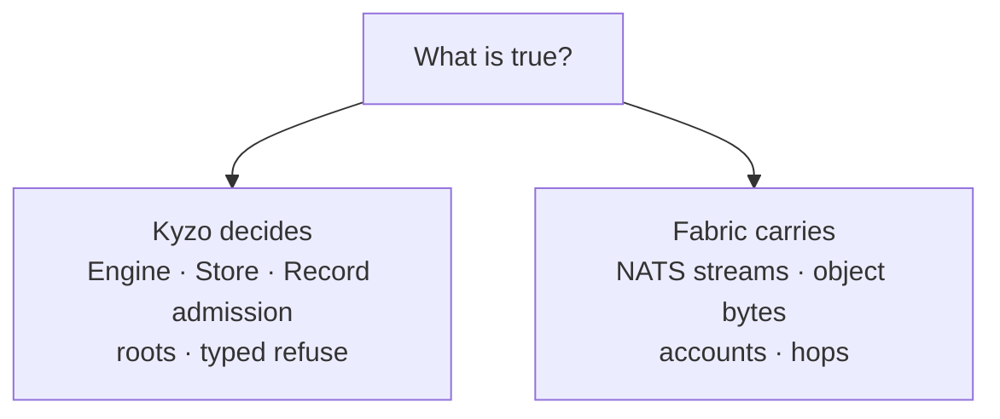

---

## First view — three pictures you must be able to see

Omitting Record-owns-meaning or the no-second-brain edges fails peer transfer. These three views are mandatory.

### 1 — Composition and admission

Who may mint meaning, and who may only interpret or persist bytes.

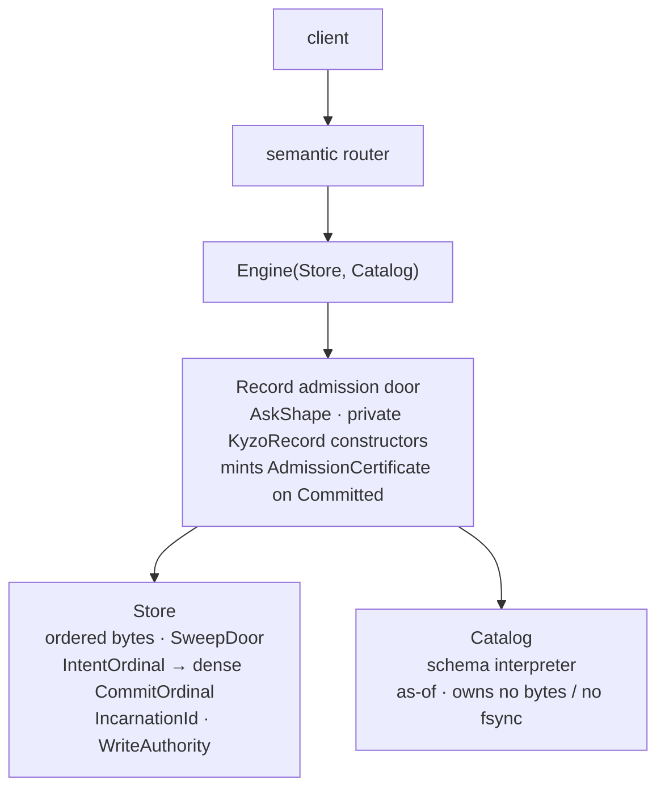

**Why three types.** If you fuse them into one ambient `Db` handle, every caller becomes a storage authority *and* a meaning authority. That is how second brains are born. The Engine *holds* capabilities; it does not become the Store.

### 2 — Durability versus residency

What survives a power cut versus what is just warm RAM.

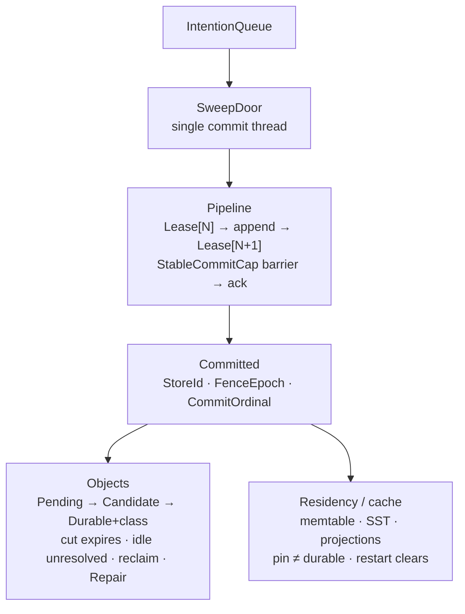

**Python intuition.** `Committed` is closer to “the write hit `fsync` and we handed you a sealed receipt” than to “the dict is updated.” A pin is closer to `functools.lru_cache` residency than to durability.

### 3 — Meaning versus NATS carriage

What the wire is allowed to be.

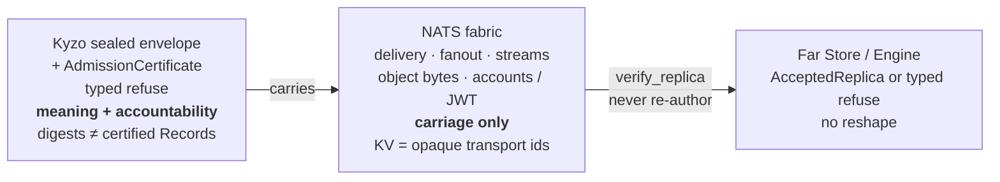

If a peer can treat a JetStream KV value as admitted knowledge without an AdmissionCertificate (or treat a certificate as a license to reshape origin meaning), you have two brains. The Spec deletes that path.

---

## Composition — Engine, Store, Catalog

Three sealed, non-interchangeable types. No public common super-type. No fused `Db`.

| Type | Owns | Never owns |
| --- | --- | --- |
| **Store** | Durable ordered bytes; the sole `StableCommitCap` / `Committed` door; dense `CommitOrdinal` and domain counters; `IncarnationId` and NonceLease floors in the WAL; write lineage under `WriteAuthority` signing | Schema interpretation; Record minting; query evaluation |
| **Catalog** | Interpretive capability only: as-of schema evaluation; admission-gating of schema-mutating Records | Bytes; fsync path; counters; any persistence type of its own |
| **Engine** | Record admission, evaluation, projection orchestration; holds Store/Catalog capabilities by composition | The Store or Catalog doors themselves; retry/scheduler adjudication between writers |

**N=1 is degenerate federation.** Laptop and enterprise share the same unskippable laws: Store identity in planning, Record admission monopoly, no anonymous local ids that later need translation, and a live `WriteAuthority` for `Committed`. An in-process Engine ask that obeys those laws is legal. Federated cuts use the semantic router; N=1 does not require a ceremonial router hop on the embed hot path. Growing N changes topology, not the contract.

**Product interface.** Clients speak one sealed Kyzo typed envelope. NATS carries that interface. HTTP/gRPC, if present at all, is a thin marshal skin—not a second meaning protocol.

### Nouns that must stay distinct

These names look adjacent. Collapsing any pair recreates a classic production bug.

| Noun | What it is | What it is not |
| --- | --- | --- |
| **Store identity** | Genesis / discovery-materialized digest | Path, URL, or “whatever directory we opened” |
| **Location** | Rebindable path/URL | Identity or write authority |
| **State root** | Accountability digest at a cut | Transport address |
| **CryptoDomain** | `(StoreId, FenceEpoch)` — crypto separator | “The Store” as a string |
| **IntentOrdinal** | Contention order minted at admission; may gap | Sealed history or StagingTTL arithmetic |
| **CommitOrdinal** | Dense committed history assigned only at SweepDoor durable event | Admission time or queue schedule |
| **WriteAuthority** | Immutable affine **signing** capability (keystore/HSM) | Something you restore from a backup tarball |
| **IncarnationId** | Durable write-session id `(OpenOrdinal, Entropy)`; OpenOrdinal is lineage-local recycle law; Entropy distinguishes clones | The signing token; a claim that clones diverge by OpenOrdinal |
| **IncarnationMintCap** | Session-only right to mint a new Id (next OpenOrdinal + Entropy) | Something that travels in leave-is-free packs |
| **CanonicalTranscript** | Frozen encoding + in-repo golden vectors for every sealed artifact | Folklore “whatever first impl does” |
| **AdmissionCertificate** | Origin-minted seal; replicas verify + mint local custody Committed | Re-author; in-place local reinterpretation |
| **CompositionId** | `H(principal, client_operation_id, composition_digest)` — client-rooted | Engine-minted process id |
| **OperationKey** | `H(domain, CompositionId, StoreId, StepId)` + request_digest memo | Mutable coordination slot; Engine-minted CompositionId |
| **ReplicaKey** | Idempotent custody identity for retained certificates | Second Record identity on the replica |
| **LocalProjection** | Rebuildable cache over origin certificate + local schema cut | In-place reinterpretation of certified meaning |
| **ForkGrant** | Seed authorizing `materialize` (pure/idempotent) of a successor lineage | One-shot event that mints fresh credentials per discovery; instant reassignment of the original’s bytes |
| **AncestorReadGrant** | Right to decrypt ancestor epochs (O(epochs) rewrap) | EpochGrant or WriteAuthority |
| **AuditKey** | Keyed MAC for leaf/history checks | Decrypt capability |
| **StableCommitCap** | Closed sum of host commit proofs; each arm declares `SnapshotFork: yes|no` | A boolean named “fsync-ish” |
| **StagingTTL** | Lifetime in dense **CommitOrdinal**s, sealed at genesis; idle Stores do not decay | Wall-clock fabric cleanup; empty tick commits |
| **ObjectDurabilityClass** | Product of sealed guarantee dimensions; dominance partial order | Total-order ladder; class-less Durable |
| **ShredSalt** | Transient plaintext derive input; memory only | Something persisted in WAL or packs |
| **WrappedShredSalt** | KEK-wrapped segment metadata; destruction handle + restore input | Plaintext salt; optional pack decoration |

**Open.** Requires privately constructed `StoreOpen` over Store identity. Path-only open is Unconstructible as success. Write-resume requires `WriteAuthority`. Without it: readers, or `ForkGrant` materialization, or quorum `RecoveryGrant` if a RecoveryMatrix was sealed at genesis. Address fence is a local mutex among Engines sharing one token—not protection against `cp -r`.

---

## What the type law buys

Each item below is a product capability that only exists because the constructors above refuse the soft alternatives.

1. **One ordered currency across modalities.** Relational joins, graph recursion, vector / FTS / geo hits, and as-of time share Tag order. Hybrid retrieval is a join through `Candidates<K>`: score chooses *who is in the room*, Tag chooses *where they sit*, Presentation chooses *how they are announced*. Exact full-scan top-k is legal (expensive, cost-refusable). Approximate is benchmark-qualified with sealed provenance—not a per-query recall promise.

2. **Knowledge that can be cross-examined.** Durable units are KyzoRecords (or rebuildable projections): provenance, authority, validity time and transaction time, supersession without overwrite. Schema mutations are Records on the Store door; Catalog interprets them as-of. Corrections append; they do not rewrite history.

3. **Evidence-bound interpretation.** Source artifacts may exist alone. Evidence coordinates exist only bound to a source. Interpreted knowledge exists only bound to evidence. Free-text “chunks” without coordinates are not evidence. The Store does not invent embedding surfaces.

4. **Placement without forking identity.** Inline versus object is physical encoding—one Record identity. `Durable(ObjectRef)` only after confirmation; `Pending` is a separate event. Query results carry opaque refs; expanding blob bytes into result meaning columns is deleted.

5. **Federation without a second brain.** NATS carries envelope + AdmissionCertificate, fanout, object bytes, accounts, leaf bridging, grants. Digests on the wire are not meaning. At-least-once delivery; exactly-once is verify_replica / retention idempotency. Fabric down → refuse; Kyzo does not peer-dial.

6. **Multi-store as composition, not 2PC.** No cross-store atomic transaction. Engine composes per-Store commits with typed partial outcomes. Writer competition is refused at construction (`AskShape`), not scheduled by an in-engine referee.

7. **Hot and durable as separate laws.** Pin is residency. Restart clears residency; `Committed` survives. “Loaded” never means durable.

8. **Operable integrity.** Hash-chained WAL. Per-commit and as-of state roots (cipher-invariant, AuditKey for leaves). Typed quarantine and poison. Dual-fault is typed partial—not one fake success.

9. **Confidentiality aligned with sovereignty.** Encrypted at rest by default. Export leaves ciphertext. Govern ≠ audit ≠ read. Grants are seeds; `materialize` is pure—successor secrets without rewriting the original lineage.

10. **Leave is free; write resume is not in the bytes.** Backups restore readable state. Writing again requires the token (or RecoveryGrant / ForkGrant). Incomplete green restore is Unconstructible.

11. **One contract across densities.** WASM, Durable Objects, native, metal: one Store law. A memory toy that passes replay tests still cannot mint production `Committed` without a sealed `StableCommitCap` arm.

---

## Ask shape — concurrency without a scheduler

Admission takes a sealed `AskShape`. The Engine does not retry for you, escalate for you, or pick a winner between two writers. You declare the shape; the door enforces it.

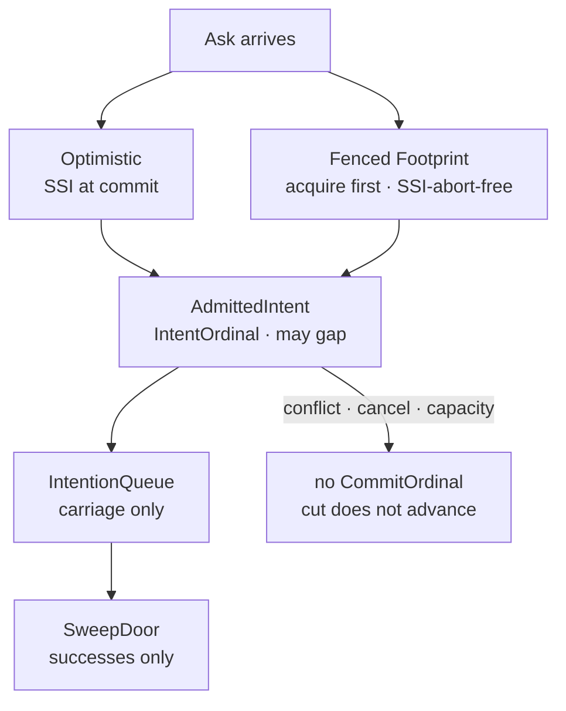

| Shape | Law |
| --- | --- |
| **Optimistic** | Full SSI validation. Conflict is a **terminal** typed refuse carrying conflicting ranges. No attempt counters, escalation windows, or Engine retry loops. Caller re-derives. |
| **Fenced(Footprint)** | Footprint is a sealed sum: Exact / Envelope / IndexDomain / WholeRelation / Frontier / Underivable. Fenced forbids Underivable. Sound supersets only. Sealed with Catalog generation and **FenceEpoch**. |

**Frontier** (graph-shaped Fenced work):

- **Direction** is in the type—reverse/bidirectional cannot construct Frontier; they fall back to Envelope.
- **Self-extension** is a plan error—edges only into the locked set or nodes minted in this ask.
- **Authority** is the reachability projection at the admission snapshot.
- **Acceleration is structure-free.** A sealed accelerator declares which results are conclusive (`NegativeConclusive` | `PositiveConclusive` | `Neither`). Inconclusive and unconfirmable → `Refuse(FrontierUnprovable)`, never admit. “Bloom” is an adapter instance, not Spec vocabulary.

**Footprints are indexed by `(FenceEpoch, IncarnationId)`** (session-memory). Prior-epoch/incarnation locks are not live. Admission checks current session; **SweepDoor rechecks** epoch+incarnation before every seal—resurrected dead-incarnation tasks get `Refuse(WriteSessionDead)` with zero bytes sealed. Observed RecoveryGrant orphans → `Refuse(AuthorityRecovered)` (recovery-link cousin). Operator: fence pressure / oldest live footprint.

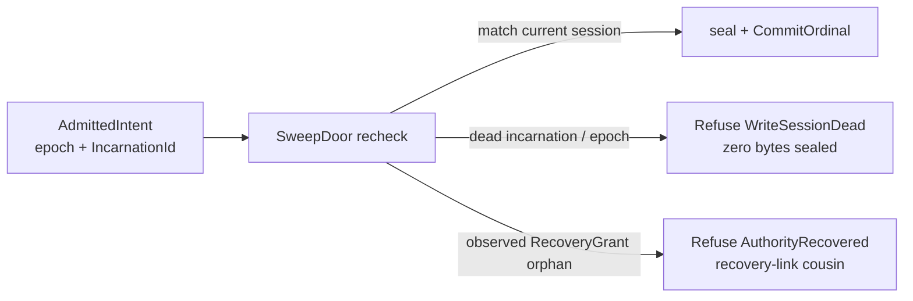

Snapshots pin past cuts. The commit critical path never waits on a reader’s pin lifetime.

---

## Durability law — the SweepDoor pipeline

Durability is not “we wrote to a file.” It is a ruled loop with a named barrier, a named order authority, and a nonce pipeline that cannot encrypt under a volatile reservation.

### Logical history vs physical batching

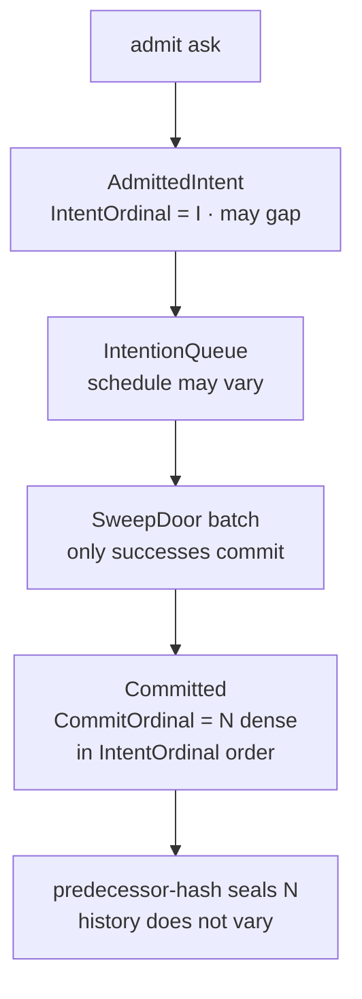

**IntentOrdinal decides who goes first; CommitOrdinal records what happened.** `CommitOrdinal` is the sole logical history authority—dense, assigned only at the durable event, never advanced by refuses/cancels. `IntentOrdinal` is contention carriage and may gap. StagingTTL, expires_at, Catalog generation, and CheckpointSeal cuts denominate in `CommitOrdinal` only. The queue and the batch are carriage—the same exclusion compaction worker races already enjoy, now stated for the door.

### Pipelined NonceLease (why one barrier is possible)

You need the lease durable *before* ciphertext exists, and you also want one barrier per batch. Those two requirements fight if you try to reserve and encrypt under the same barrier. The ruled shape pipelines them:

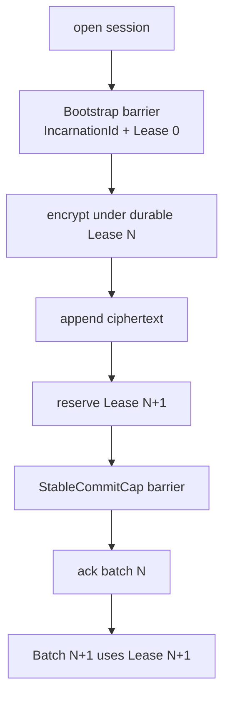

Same pipeline shape for `Commit`, `Compact`, and `Rotate` domain counters. Unused lease remainder burns. Gaps are legal. Early ack, timer coalescing, and encrypt-under-volatile-reserve are Unconstructible.

`WriteAuthority` **signs** the door. It does not carry a mutable watermark. Mutable floors live in the WAL only.

### Objects — strip-then-confirm with a recoverable middle

Logical naming stays simple: `Pending` or `Durable`.

Physical life has three states, because crash between “stripped volatile” and “Durable supersession” is real. Two frames: staging/cut, then Durable promise + Repair.

**Frame A — staging and the cut**

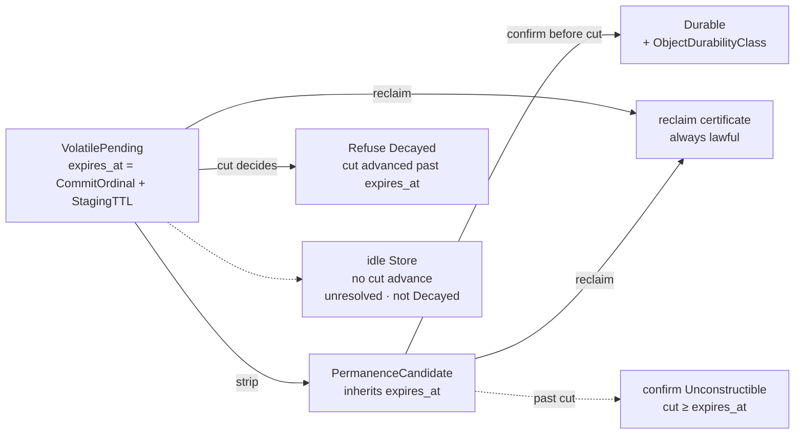

**Frame B — Durable class and Repair**

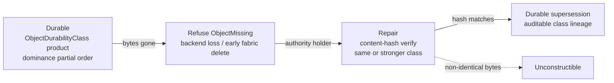

- Fabric may delete bytes early or late relative to wall clock.
- **Whether the Pending reference is expired** is decided by comparing Store cuts.
- Past cut → `Refuse(Decayed)`.
- Fabric deleted while cut still live → `Refuse(ObjectMissing)`.
- **PermanenceCandidate inherits `expires_at`.** Before cut: confirm or reclaim. At or past cut: reclaim only. `PermanenceWitness::mint(cut)` is Unconstructible when `cut ≥ expires_at`—late confirmation has no constructor.
- **Idle Stores:** no CommitOrdinal advance → nothing expires; staged objects are unresolved, not decayed (deliberate law). Reclaim certificate covers VolatilePending and PermanenceCandidate—capability-decided, idle or busy. Empty tick commits Unconstructible.
- **`ObjectDurabilityClass`** is a **product** of sealed dimensions (copies, domains, regions, consistency, integrity, backend_contract)—not a total-order ladder. Repair requires **dominance** at `PermanenceWitness`; incomparable refuses; **Downgrade** is a typed auditable supersession.

**Frame C — dominance (partial order), not a ladder**

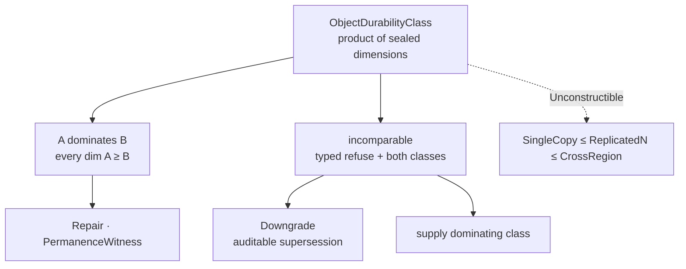

- **`Repair`:** content-hash-verified re-stage; non-identical bytes Unconstructible; non-dominating class Unconstructible.
- Immortal orphan and cut-bypass resurrection are Unconstructible.
- CheckpointSeal (under CanonicalTranscript) binds a **live candidate manifest**; restore that silently loses reclaim obligations → `Refuse(SealMismatch)`.

| State | What the client may assume | What the client must handle |
| --- | --- | --- |
| **Pending** | Ref licensed; expiry decided by Store cut | `Decayed`, `ObjectMissing` |
| **PermanenceCandidate** | No ordinary read | Becomes Durable, or reclaim-only past cut |
| **Durable** | Sealed durability **product** (dominance order) | Corruption / unavailability; **Repair** / **Downgrade** |

### What may truncate history

Within the retained WAL suffix, `WAL.replay()` reconstructs Engine-visible state after wiping memtables and SSTs—those are cache.

Truncation consumes a `CheckpointSeal` that binds concrete digests (StoreId, CryptoDomain, cut, root, WAL hash, manifests including Pending-at-cut, **live PermanenceCandidate set**, **retained-certificate / ReplicaCustody** (PendingAnchor + Queryable), NonceLease floors, **IncarnationId history boundary**, prior seal). Mismatch → `Refuse(SealMismatch)`. Unsealed dumps are disposable. Seals never span epoch transitions.

### License for the word “durable”

Power-cut, pipeline, Incarnation at-rest, live-fork (SIV arms), RecoveryGrant / AuthorityRecovered, PermanenceCandidate, StagingTTL cut, and per-arm StableCommitCap campaigns. The recovery SLA bound refuses a *claim*, not open of a physically recoverable Store.

---

## Authority, epochs, forks, and recovery

Epoch authority is Store-local. Genesis seals `FenceEpoch`, `CryptoDomain`, and optional sovereignty params (`RecoveryMatrix`, ordinal `StagingTTL`). Fabric **carries** grants; it never mints write continuity.

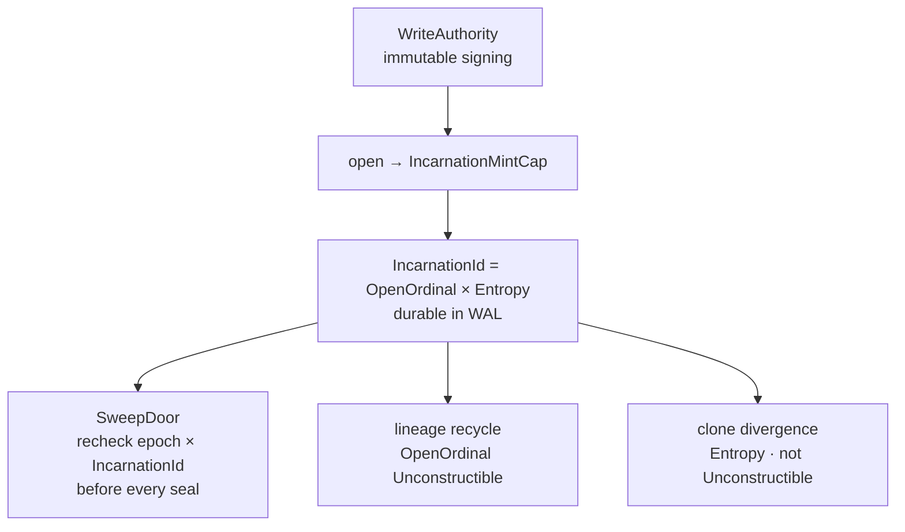

| Path | What happens |
| --- | --- |
| **Same principal + live token** | Epoch advance with IntentClear. Current-epoch live footprint → `Refuse(EpochAdvanceBlocked)`. New CryptoDomain; **same KEK**; new IncarnationId. |
| **Same principal + lost token + RecoveryMatrix** | Quorum `RecoveryGrant` is a **seed**; `materialize` pure/idempotent. New CryptoDomain + new WriteAuthority; same KEK; typed recovery root link. Second grant for same predecessor epoch → equivocation poison. **Observers:** stale-epoch `Committed` Unconstructible (forward fencing). **Oblivious partitioned holder:** dual-history Unexposed until meet → poison + remediation (same physics as ForkGrant’s oblivious original). Footprints epoch- and incarnation-indexed. Orphans that observed recovery → `Refuse(AuthorityRecovered)`. No matrix → lost token means fork only. |
| **Different principal** | `ForkGrant` seals fork-point root **and** successor identity seed / key-material commitment. **`materialize(ForkGrant)`** is deterministic and idempotent—same grant → same successor StoreId and derivation inputs; discovery draws no identity entropy outside the grant. Second discovery converges or `Refuse(GrantAlreadyMaterialized)`. Divergent successors Unconstructible. Original lineage continues under the original domain. Pre-fork history readable under `AncestorReadGrant`. |

### Observation fence vs partition dual-history

Epoch advance and RecoveryGrant fence **forward for observers**. They do not prevent offline dual-history a partitioned process cannot see—same physics as ForkGrant’s oblivious original.

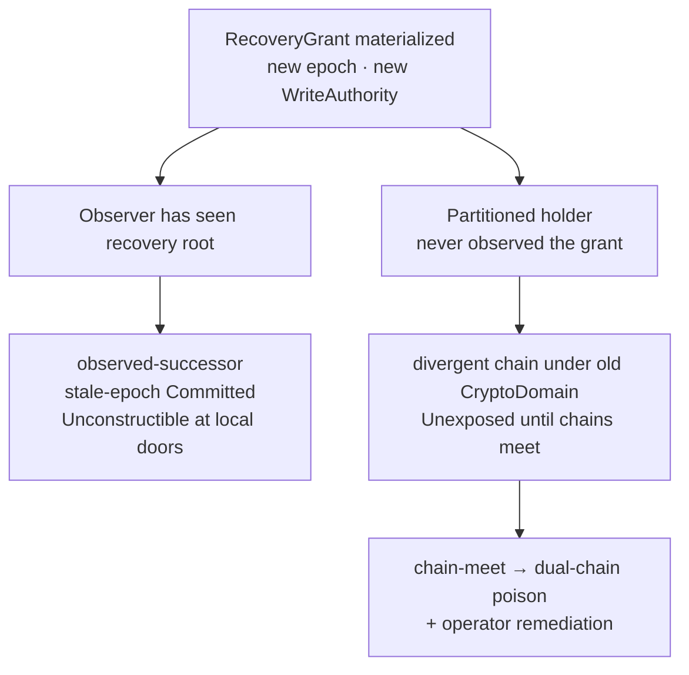

### ForkGrant — no action at a distance

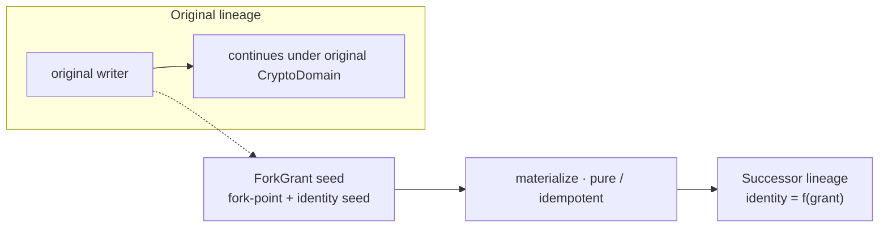

A grant is a seed, not an event—seeds must grow the same plant twice. There is no “post-grant pre-discovery shared confidentiality window” to close with a special Rotate. Successor secrets are born under fork KEK from the grant’s key-material commitment. In-lineage Rotate for shred/key rotation still exists; fork-confidentiality Rotate is deleted.

### Copy and live-fork honesty

| Situation | Claim tag | Bound |
| --- | --- | --- |
| Historical Id recycle inside one WAL lineage | **Unconstructible** | `OpenOrdinal` must strictly exceed every sealed predecessor in that lineage |
| Two at-rest clones of identical sealed bytes; both open offline | Clone Id divergence via **Entropy** (cryptographically negligible under approved arm)—**not** Unconstructible | Same next OpenOrdinal (M+1); DomainCounters restart identically; bounds: dual-chain poison + SIV when cloning is routine |
| Live process / snapshot fork mid-session (SnapStart, Firecracker clone, …) | **Unexposed** | Arm declares `SnapshotFork`; if yes, misuse-resistant AEAD (SIV) required—equality leak remains Unexposed |
| Optional host `ForkGenerationWitness` | Remint Id on generation change | Uniqueness Unconstructible **for that arm** |
| Partitioned writer through RecoveryGrant (never observed the grant) | **Unexposed** until chains meet | Forward fencing Unconstructible only for nodes that observed recovery; dual-history → poison + remediation |

Dual-use **lineage** (two commit chains under one CryptoDomain) is Unexposed until chains meet → poison. Chain-meet protects lineage integrity, never AEAD. Claiming at-rest uniqueness from Entropy alone as Spec-green Unconstructible is fraud.

HA is **token move**, not “clone the directory.”

---

## Order law — Tag, Candidates, Presentation

One law, three concepts, no fourth.

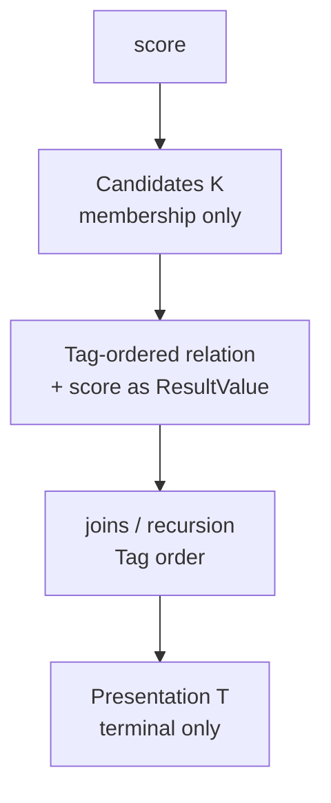

- **Tag order** is what storage and joins obey. Score types are `ResultValue` only—they do not implement `TagOrdered`. A durable score-ordered index fails to compile.
- **`Candidates<K>`** bounds **output cardinality**, not scoring work. Exact full-scan top-k is legal under cost refuse. Approximate carries a sealed benchmark contract as provenance—not Exact bit-identity, not a per-query recall promise.
- **`Presentation<T>`** is outermost only. Join or range over Presentation is a construction error.

One sentence: the law bounds how many enter the room, never how hard the doorman looked; Tag seats them; Presentation announces.

---

## Integrity law

Every sealed artifact shares one signed-byte law:

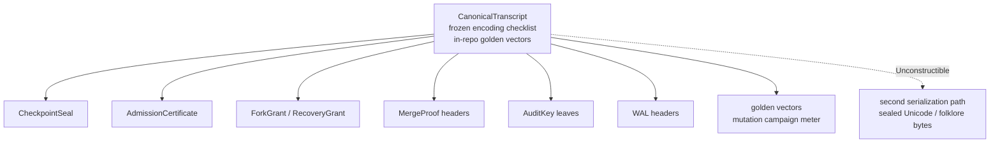

| Concern | Rule |
| --- | --- |
| Block identity | Table/keyspace-scoped checksums |
| Quarantine | Range-scoped refuse; rest of keyspace stays up; no last-known-good |
| Poison | Store-global unknown-invariant; dominates when both quarantine and poison apply |
| Projections | Rebuildable cache; disagreement → rebuild or refuse |
| Dual fault | Typed partial: intact ordered facts + named `ObjectCorrupt` when objects are wrong |
| Equivalence | Cut equality = recomputed roots; fork-equivalence = shared fork-point root; path/URL “same Store” refused |
| Roots | Plaintext-canonical, cipher-invariant; leaf MAC under AuditKey; CheckpointSeal binds digests + IncarnationId boundary |

---

## Confidentiality — capability lattice

Holding the root KEK is not the same as being allowed to govern writes, audit history, or read ancestors. Those are different doors.

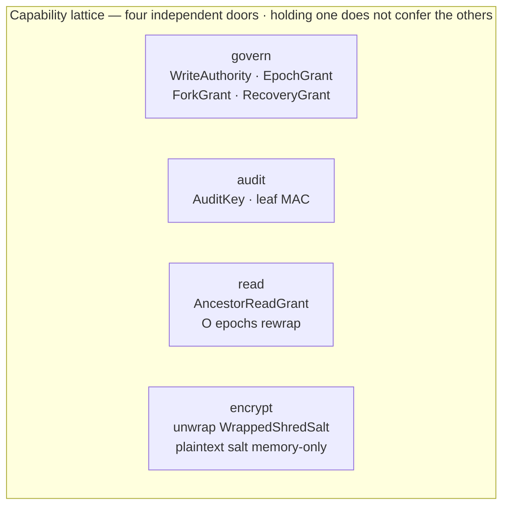

| Concern | Rule |
| --- | --- |
| Default | Encrypt at rest; one path; no plaintext mode flag |
| Export | Leaves ciphertext; decrypt-export deleted |
| Open | Client/HSM root KEK + WriteAuthority for write-resume |
| Keys | `DEK = derive(KEK, CryptoDomain, SegmentCounter, ShredSalt)` after unwrap of **`WrappedShredSalt`**; plaintext salt is memory-only |
| Shred | Destroy `WrappedShredSalt` + authorized replicas (sovereignty boundary, packs via retention); exfiltrated copies outside threat model |
| Nonce | `pure(MintDomain, DomainCounter, CryptoDomain, IncarnationId)` via pipelined NonceLease |
| AEAD | SIV when SnapshotFork=yes; never claim live-fork “safe” or equality-hiding |
| Hygiene | DEK/KEK/plaintext ShredSalt/WA/AuditKey/IncarnationMintCap never in packs; **WrappedShredSalt + IncarnationId history required** |
| Delete | Crypto-shred + Store-scoped object GC |

---

## Federation and the product interface

Meaning lives in the sealed Kyzo envelope and Record admission. NATS is the nervous system: subjects, streams, accounts/JWT, object-byte carriage, leaf bridging, grants. It does not hold admitted truth.

### AdmissionCertificate — authoring vs replica verification

Authoring mints `Committed` **and** a sealed `AdmissionCertificate`. Accepting verify **mints local custody `Committed`** (ReplicaKey-idempotent). Origin interpretation is sealed to the certificate schema cut.

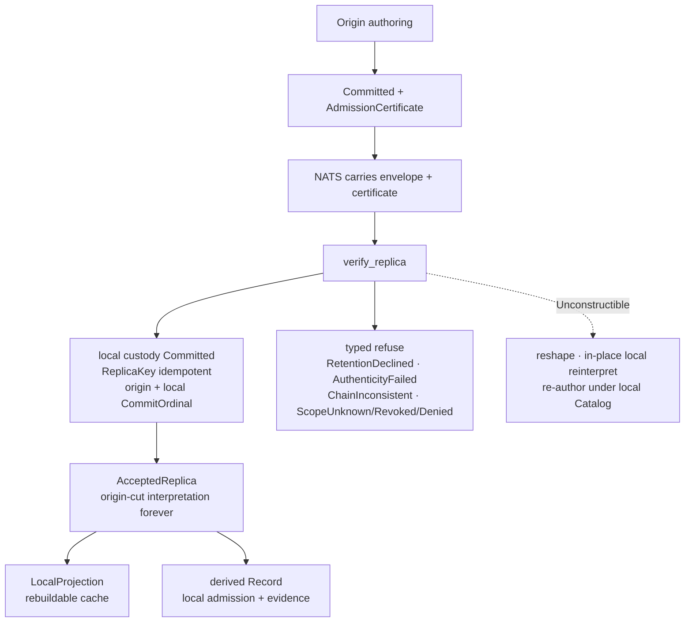

**ReplicaCustody:** `Queryable | PendingAnchor`. Out-of-order certificates may be retained opaque; they become queryable only when an authenticated seal or contiguous chain anchors origin coordinates. Never-anchored PendingAnchor is reclaimable (operator pressure).

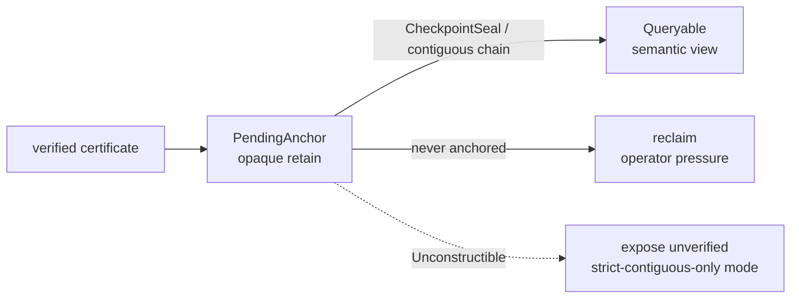

Manifest resolution is typed (`ScopeUnknown` / `ScopeRevoked` / `ScopeDenied`) and never folded into `RetentionDeclined`.

### Cross-Store composition (no folklore 2PC)

Closed sum: **`BestEffort` | `Saga` | `ReadAt`**. **`CompositionId = H(principal, client_operation_id, canonical_composition_digest)`** is client-rooted—Engine-mint Unconstructible; fresh processes re-derive from the same durable client intent. `OperationKey = H(domain_label, CompositionId, StoreId, StepId)` with memo `(key, request_digest, OperationOutcome)` where **`OperationOutcome = Committed | DeterministicTerminalRefuse | Absent`**. Same key + different digest → `Refuse(OperationKeyReuse)`. Transient refuses are never terminal memos. Saga compensations share the CompositionId. ReadAt returns a vector of per-Store cuts and does not mint OperationKey entries—global snapshot Unconstructible. Engine crash mid-composition → fresh process retries by asking each Store; duplicate semantic effects Unconstructible. Client-lost `client_operation_id` is Unexposed at the client boundary.

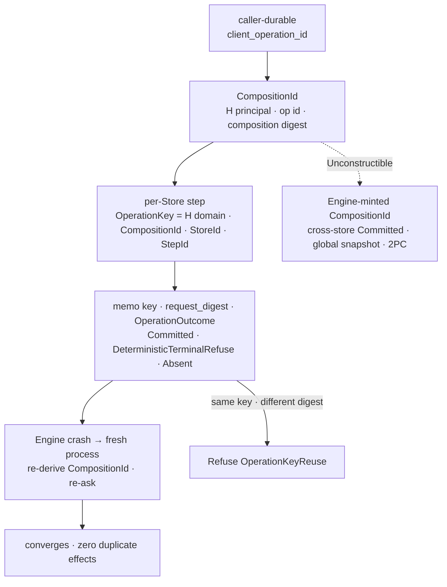

- Sealed Record **envelope + AdmissionCertificate** move on the fabric; digests/refs alone are not meaning. Far side runs `verify_replica`, mints local custody `Committed`, and keeps origin-cut interpretation—`LocalProjection` or derived Record only; never in-place local reinterpret.
- Object movement uses the Store object seam; federation cannot invent orphan objects.
- Manifest cuts require signed capability / graph-scope; without that field, fan-out-to-every-node is illegal.
- JetStream KV: opaque transport ids and signed network metadata only—no RecordId-shaped tokens.
- Partition / offline: exclusivity is held `WriteAuthority` / `CryptoDomain`. Reconnect discovers facts—no merge ceremony. Explicit Engine composition across identities only.

---

## Local adapter and performance

Store is a capability boundary. LSM / fjall is one adapter behind it—not the product. Any backend that implements the Store contract and a sealed `StableCommitCap` arm may mint `Committed`.

What purity buys is **determinism and bounded cost**, not “fastest LSM on earth.”

| Path | Shape |
| --- | --- |
| Local ask | TagOrdered seeks; Candidates for score membership; projections as caches; Presentation terminal only |
| Commit | StableCommitCap-bounded fact door; Durable object naming is a separate supersession |
| Compaction | `pace = f(debt)`. Merged packets only via private `MergeProof` over plaintext content hashes / lineage (Compact-domain counters under the door). Sealed identity = plaintext lineage + roots—never ciphertext. Release blockers: WA and retain/space amp |
| Admission | AskShape at the door; Engine starts-or-not vs Store debt—two taxonomies; no silent stall |
| Federation | Local program on pruned cuts; end-to-end = local eval + fabric hop |
| Density | Active set fits isolate or refuse and name Dedicated |
| Residency | Large durable set, small hot RAM; pin budgets |

**MergeProof (compaction mint).** Compaction may copy sealed packets unchanged, or mint a merged packet only through a private `MergeProof` that requires the inputs’ plaintext content hashes and lineage, sealed into the output header, advancing Compact-domain counters under the write fence. A compacted packet without lawful `MergeProof` is Unconstructible. Sealed / DST-replayable identity is over plaintext content, lineage hashes, and state roots—never ciphertext bytes. Plaintext `ShredSalt` regeneration (new `WrappedShredSalt`) under MergeProof does not change sealed identity.

Bench emit requires opponent pin, answer-agreement, and a tagged Spec/bench identity—naked numbers refuse.

Expect SQLite-class local feel on a hot Store, stream-replay catch-up for replicas, and manifest-pruned federation. Numbers are Spec law from benches and DST.

---

## Hosts, leave-is-free, and operation

**Density honesty.** Without a sealed `StableCommitCap` arm (with `SnapshotFork` declared), `WriteAuthority`, and session `IncarnationId`, production `Committed` is Unconstructible. WASM/DO hold the token in platform keystores or refuse.

**Placement.** Admission checks geography / residency policy before durable put; forbidden placement refuses.

**Leave-is-free.** Full WAL + retained objects, or CheckpointSeal + WAL suffix + retained objects, at cut X. Incomplete green restore is Unconstructible. Packs exclude WA/KEK/plaintext ShredSalt/AuditKey/`IncarnationMintCap` and **include** `WrappedShredSalt` per retained encrypted segment + `IncarnationId` history. Post-shred restore of an old pack → typed `Refuse(Shredded)` for that segment (neighbors decrypt)—not silent unreadability. Restore without token → reader, `materialize(ForkGrant)`, or RecoveryGrant. Cut-expired Pending → Decayed; early fabric delete → ObjectMissing; candidate past cut → reclaim only.

**Health.** Debt, reclaimable, quarantine, last verify on a sealed **operator** surface only—not ordinary tenant queries.

**CanonicalTranscript.** One versioned normative signed-byte definition (encoding checklist as law: field order, integer widths, bytes/typed ids only—no sealed Unicode normalization surfaces, map ordering, bounds before alloc, unknown version refuses) for CheckpointSeal, AdmissionCertificate, ForkGrant, RecoveryGrant, MergeProof headers, AuditKey leaves, WAL headers. **In-repo golden vectors** per sealed artifact kind; mutation campaigns assert against them. Second serialization path Unconstructible.

**DST-sealed artifacts.** WAL segments (epoch-headed, including NonceLease and IncarnationId records), state roots, CheckpointSeal, FormatVersioned dump (disposable without seal), retain certificates, debt→pace / leveling outcomes, Compact-domain `MergeProof` identity, and AdmissionCertificates—all under CanonicalTranscript. Unseeded RNG on those paths is Unconstructible.

---

## Scale

**Does not scale as:** one petabyte single LSM; one process holding all truth hot; silent auto-split; “NATS holds the truth.”

**Does scale as:** many sovereign Stores under one contract.

```mermaid
flowchart TB
    SR["semantic router<br/>capability · graph · manifest cuts<br/>scope mandatory"]
    SR --> A["Engine Store Catalog A<br/>laptop"]
    SR --> B["Engine Store Catalog B<br/>agent mem"]
    SR --> C["Engine Store Catalog C<br/>plant edge"]
    SR --> D["Engine Store Catalog D<br/>tenant"]
    SR --> E["Engine Store Catalog …<br/>DO / WASM"]
    A --> NATS["NATS fabric<br/>streams · objects · accounts · leaf · grants"]
    B --> NATS
    C --> NATS
    D --> NATS
    E --> NATS
    class SR meaning
    class A,B,C,D,E store
    class NATS fabric
```

| Axis | Model |
| --- | --- |
| Per Store | Human-operable ceiling; writes refuse at capacity; Engine may compose a split as workflow |
| Per process | Many Stores; lazy open; hot ≪ durable |
| Per federation | Add Stores, leafs, accounts; fan-out bounded by signed scope |
| Aggregate | Sum of sovereign graphs under one contract |
| Media | Object backends scale independently; ordered store holds facts + refs |
| Tenancy | Crypto + capability + NATS accounts |

The interesting unit is the sovereign graph, not the warehouse.

---

## Who can do what

| Actor | Can |
| --- | --- |
| **Apps / agents** | Append through sealed doors; declare Optimistic or Fenced; use Candidates; handle Pending / Decayed / ObjectMissing / Durable / AuthorityRecovered; never mint Records |
| **Edge / plant / laptop** | Hold WriteAuthority; optional RecoveryMatrix with distinct custodians; IntentClear before ordinary advance; lost token → RecoveryGrant or ForkGrant |
| **Enterprise** | Federated query by capability / graph-scope; tenant blindness; placement refuse-before-write |
| **Cloud ops** | Provision Stores like files; never pack WA/MintCap into backups; reclaim staged pressure; fabric executes cut-decided decay only when history advances |
| **Auditor / peer** | Walk ordinary / recovery / fork root links under AuditKey; campaigns license claims |

### By construction (grouped)

**Meaning**

- Meaning in objects or KV; RecordId-shaped KV tokens; chunks as truth; expand object bytes into result meaning — Unconstructible / Refused  
- `Store::put_record` / app claim-upsert / chunk-as-fact; decrypt-export for app reindex — Unconstructible  
- Catalog with its own persistence / fsync / counters — Unconstructible  
- Fused `Db`; path-only open — Unconstructible  

**Durability and order**

- Timer coalesce / early ack / volatile NonceLease reserve / watermark — Unconstructible  
- Scheduler-chosen history without AdmittedIntent; history minted at admission; refuse advancing CommitOrdinal — Unconstructible  
- Truncate without CheckpointSeal; prefer-dump; silent SealMismatch — Unconstructible  
- Incomplete green leave-is-free restore; WA/MintCap smuggled into packs — Unconstructible  

**Authority and fork**

- In-place WriteAuthority reissue for the same epoch — Unconstructible  
- Retroactive lineage reassignment; divergent successors from one ForkGrant; second RecoveryGrant for one predecessor epoch as a second lineage — Unconstructible  
- Fabric-only epoch mint; advance under current-epoch Fenced footprints — Unconstructible / Refused  
- Prior-epoch footprint as a live lock after recovery — Unconstructible  

**Crypto honesty**

- Historical Id recycle inside one WAL lineage — Unconstructible  
- Clone-vs-clone nonce distinctness tagged Unconstructible; claiming uniqueness from Entropy alone as Spec-green — Refused (fraud)  
- Live-fork mid-session; partitioned oblivious writer through recovery — Unexposed (SIV / dual-chain poison as bounds)  
- Dual-use lineage — Unexposed until chains meet → poison  
- Re-authoring / reshaping / in-place local reinterpret of a certified replica record; second serialization path for sealed artifacts — Unconstructible  
- Engine-minted CompositionId; OperationKeyReuse silent overwrite; terminal memo of transient refuse — Unconstructible  
- Soft durability ladder; Repair under non-dominating class without Downgrade — Unconstructible  
- SweepDoor seal under dead incarnation/epoch (WriteSessionDead bypass) — Unconstructible  
- Expose never-anchored PendingAnchor as queryable; fold ScopeUnknown into RetentionDeclined — Unconstructible  
- Durable lock organ / lock-expiry timer / empty tick commits to force StagingTTL — Unconstructible  
- Cross-store Committed / global snapshot / TryAtomic; Repair with non-identical bytes — Unconstructible  
- Compacted packet without lawful `MergeProof`; ciphertext bit-identity as sealed compact identity — Unconstructible  
- Plaintext `ShredSalt` persistence; leave-is-free without `WrappedShredSalt`; post-shred silent unreadability — Unconstructible  

**Objects and Frontier**

- Confirm-then-strip; immortal PermanenceCandidate; confirm at/past expires_at; wall-clock fabric as expiry authority — Unconstructible  
- Accelerator-as-admission-authority; reverse Frontier — Unconstructible / Refused  

**Carriage**

- Carriage timing/probability/cleanup as authority for what exists — Refused as Spec-green  

### Typed Spec obligations

- **KyzoScript:** footprint algebra incl. Frontier + epoch index; Underivable cannot request Fenced; Candidates Exact/Approximate with provenance; handle AuthorityRecovered  
- **Clients:** Pending/Decayed/ObjectMissing/Durable(+class); PermanenceCandidate; Repair; CompositionShape; hold WA/AuditKey/AncestorReadGrant/MintCap outside packs  
- **Edge operators:** IntentClear before ordinary advance; lost token → RecoveryGrant or ForkGrant; staged-object + fence pressure; recovery custodians ≠ WA holder  
- **Hosts:** genesis seals CryptoDomain + WA + optional RecoveryMatrix/StagingTTL; SweepDoor + StableCommitCap (SnapshotFork); object-backend arms declare ObjectDurabilityClass; IncarnationId+Lease[0] bootstrap; CanonicalTranscript  
- **Spec authors:** matrix + campaigns; claim-tag boundary; freeze; carriage executes never decides  

---

## Constructor interaction matrix + adversarial campaigns

Individual constructor laws are strong enough that remaining risk lives in their **products**—and in assumptions under all of them. Spec v1 ships two falsification surfaces:

1. **Constructor interaction matrix** with closure: every pair independent or named joint proof; new seat × all existing; changed row reopens adjacent.  
2. **Adversarial DST campaigns** as merge gates: inject failure / hostile copy and verify the law holds.

**Freeze.** Spec v1 is matrix closure, claim tags, and adversarial campaigns as executable merge gates. Every future change must cite a **failed campaign** or a **failed matrix row**.

Preamble lessons worth keeping on the wall: a seat that trades randomness for derive must name the destruction primitive; **bytes and write authority were never the same thing**; **a grant is a seed, not an event**; **IntentOrdinal decides who goes first; CommitOrdinal records what happened**; **authoring mints, replicas verify + mint custody**; **origin-cut interpretation is sealed—LocalProjection or derived Record only**; **CompositionId is client-rooted**; **OpenOrdinal is lineage-local; Entropy distinguishes clones**; **observation fences forward—offline dual-history is Unexposed until meet**; **SweepDoor rechecks session before every seal**; **durability is a product under dominance, not a ladder**; **Unconstructible stops at the crate boundary**; **these are verb holes, not noun holes**—every constructor law must state retry, partial failure, and lateness; **chain-meet is lineage, never AEAD**; **external systems may execute Kyzo’s decisions and accelerate Kyzo’s checks, but must never become the authority for what exists**. Stop editing disputed signatures—campaigns hold the pen.

Minimum closed joint proofs (non-exhaustive):

| Pair | Joint law / proof |
| --- | --- |
| WriteAuthority × leave-is-free | Token/MintCap excluded; restore-then-write needs token, RecoveryGrant, or ForkGrant |
| WriteAuthority × ForkGrant | Discovery mints new WA; original unchanged |
| WriteAuthority × density | WASM/DO keystore or refuse production Committed |
| WriteAuthority × IncarnationId | WA signs; Id separates nonce space; no watermark |
| IncarnationId × leave-is-free | Id history travels; MintCap never |
| IncarnationId × OpenOrdinal | Recycle Unconstructible (lineage-local); clone divergence Entropy-bounded—not Unconstructible |
| IncarnationId × CheckpointSeal | History boundary bound |
| IncarnationMintCap × hygiene | Never exported |
| IncarnationId × live-fork | Unexposed mid-session; SIV when SnapshotFork=yes; optional ForkGenerationWitness |
| IncarnationId × StableCommitCap | Arm declares SnapshotFork; SIV condition |
| RecoveryMatrix × FenceEpoch | One grant/epoch; equivocation poison; forward fencing vs partition Unexposed |
| RecoveryMatrix × Footprint | Epoch+incarnation indexed; AuthorityRecovered for observers |
| CanonicalTranscript × sealed artifacts | One transcript/AAD path; second serialization Unconstructible |
| AdmissionCertificate × Record admission | Authoring mints; verify_replica only; no reshape |
| AdmissionCertificate × CanonicalTranscript | Certificate bytes under one transcript law; golden vectors |
| AcceptedReplica × Catalog | Origin-cut interpretation forever; LocalProjection or derived Record only |
| LocalProjection × rebuildability | Cache; never Record meaning; rebuild from certificate + local cut |
| ReplicaCustody × CheckpointSeal | Retained certificates in seal; silent loss → SealMismatch |
| ReplicaCustody × PendingAnchor | Anchored-sparse queryability; never-anchored reclaim |
| Manifest × verify_replica | ScopeUnknown/Revoked/Denied ≠ RetentionDeclined |
| Footprint × IncarnationId | Prior-incarnation locks not live; session-memory only |
| Footprint × crash recovery | Locks dead at next open; zero durable residue |
| SweepDoor × WriteSessionDead | Epoch+IncarnationId recheck before every seal; zero bytes on refuse |
| CompositionId × client root | Client-durable op id; Engine-mint Unconstructible; re-derive on crash |
| OperationKey × idempotency | request_digest + OperationOutcome; reuse refuse; retry converges |
| ObjectDurabilityClass × dominance | Product partial order; Repair dominates or Downgrade |
| Saga × supersession | Compensations append-only; Engine does not adjudicate |
| ReadAt × snapshot law | Vector of cuts; global snapshot Unconstructible |
| StagingTTL × idle | No decay without cut advance; by law |
| reclaim × VolatilePending | Capability-decided; idle or busy |
| PermanenceWitness × ObjectDurabilityClass | Class sealed into Durable; arm-licensed |
| Repair × content hash | Non-identical bytes Unconstructible |
| RecoveryMatrix × root chain | Typed recovery link |
| SweepDoor × NonceLease | Pipelined Lease[N]/Lease[N+1]; all MintDomains |
| SweepDoor × AdmittedIntent | Batching never reorders relative IntentOrdinal among successes |
| SweepDoor × StableCommitCap | Barrier is arm commit proof; wake ≠ timer |
| AdmittedIntent × sealed identity | CommitOrdinal = sole logical history; IntentOrdinal = contention carriage; hash seals CommitOrdinal |
| ObjectSlot × StagingTTL | CommitOrdinal expires_at; cut decides |
| PermanenceCandidate × GC | Two exits before cut, reclaim only after; resurrection Unconstructible |
| StagingTTL × leave-is-free | Decayed vs ObjectMissing; idle unresolved until reclaim or cut |
| Frontier × SSI | Abort-free under Direction law |
| Frontier × accelerator | Projection authority; conclusive-side declared |
| Frontier × Footprint × FenceEpoch | Prior-epoch / prior-incarnation locks not live |
| CheckpointSeal × leave-is-free | Seal + suffix + objects + candidate manifest or SealMismatch |
| Shred × DEK-derive | WrappedShredSalt = destruction handle + restore input; plaintext salt has no persistence constructor |
| Shred × leave-is-free | Packs require WrappedShredSalt; post-shred → typed Shredded tombstone |
| AncestorReadGrant × ForkGrant | Cross-fork Unconstructible |
| AuditKey × roots | Leaf MAC requires AuditKey |
| ForkGrant × identity | Double-discovery converges or refuses; divergent successors Unconstructible; retroactive reassignment Unconstructible |
| ForkGrant × KEK | Successor secrets from grant key-material commitment under fork KEK |
| Candidates × TagOrdered / Presentation | K = output cardinality; Approximate provenance |
| MergeProof × Compact NonceLease | Compact-domain counters under the door; zero reuse |
| MergeProof × WrappedShredSalt | Sealed identity = plaintext / lineage / roots—never ciphertext; salt regen ok |
| MergeProof × sealed identity | Packet without MergeProof Unconstructible |
| Catalog × durability door | No Catalog write path |
| StableCommitCap × kit | Kit + arm + WA + IncarnationId |

Minimum adversarial DST campaigns (merge gates): **two-clone at-rest** (equal OpenOrdinal, differing Entropy, zero key/nonce collisions); **partitioned old-writer through RecoveryGrant**; **live-fork mid-sweep** (SIV); **pipeline power-cut**; **mixed-load IntentOrdinal/CommitOrdinal**; **CanonicalTranscript mutation** vs golden vectors; **Catalog-advance origin-interpretation** (AcceptedReplica unchanged + LocalProjection rebuild); **five-delivery custody** (ReplicaKey idempotent); **reversed/gapped/forged-manifest** + accept-then-revoke; **old-session resurrection** → WriteSessionDead at every pipeline boundary; **CompositionId crash-before-return** + OperationKeyReuse; **durability dominance / incomparable / Downgrade**; **AdmissionCertificate** under lagging/leading/incompatible Catalog cuts; **Footprint crash-holder** at every stage; **composition Engine-crash** + fresh retry (zero duplicate effects); **idle StagingTTL** (no decay; reclaim); **ObjectDurabilityClass** confirm/destroy/Repair; RecoveryGrant mid-ask + equivocation; ForkGrant double-discovery; PermanenceCandidate strip/stall-past-cut; StagingTTL early/late fabric; CheckpointSeal SealMismatch (incl. ReplicaCustody); MergeProof; ShredSalt leave-is-free; dual-chain poison; per-arm StableCommitCap.

**Nonce / WriteAuthority / SnapshotFork signatures stay unfrozen until at-rest and live-fork campaigns are green.**

Tedious; necessary. Matrix catches law products on paper; campaigns catch assumptions under injected failure. The next bug of this class is found by a fault injector, not another prose pass.

---

## Ideal, in one sentence

An authorized client asks through one sealed Kyzo envelope, carried on NATS, over sovereign Stores under `Engine(Store, Catalog)` law, and receives a replayable answer or a typed refuse—across edge and cloud—where pipelined SweepDoor + StableCommitCap is the ruled commit loop with WriteSessionDead on dead-session resurrection, IntentOrdinal orders contenders and CommitOrdinal records dense history, WriteAuthority is recoverable only by observed epoch advance, IncarnationId makes lineage-local Id recycle Unconstructible while clone divergence and live-fork stay honestly Entropy/Unexposed-bounded, grants and certificates are seeds and transcripts whose verify paths mint local custody without reshaping origin-cut meaning, footprints die with their incarnation, composition is client-rooted CompositionId plus OperationKey/OperationOutcome instead of folklore 2PC, staging idles without timer decay and Durable names an ObjectDurabilityClass product under dominance with Repair or Downgrade as the way back from ObjectMissing, CanonicalTranscript is the one signed-byte law with golden vectors, illegal programs are Unconstructible inside the crate boundary, joint products and adversarial campaigns are merge-gated, and carriage never decides what exists.

---

*Sourced from ruled seats in `decisions.md` (L1–L14). Spec v1 freezes on matrix closure, claim tags, and adversarial DST campaigns (at-rest IncarnationId + live-fork SIV arms gate nonce/authority freeze); further law cites a failed campaign or matrix row. Carriage executes; Kyzo decides.*
